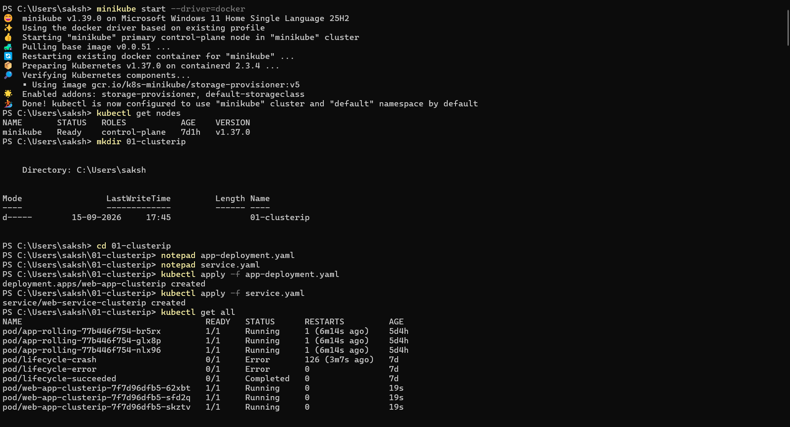
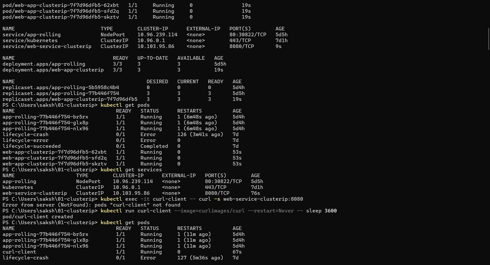
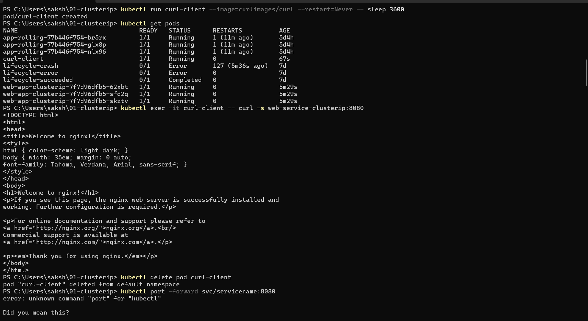
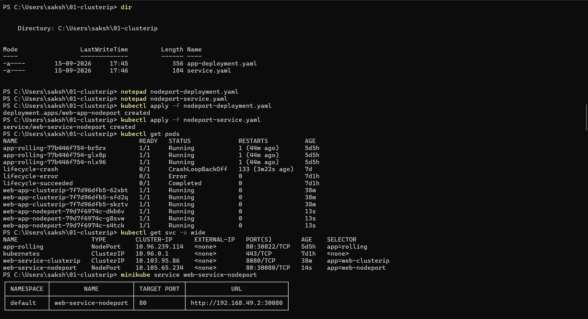
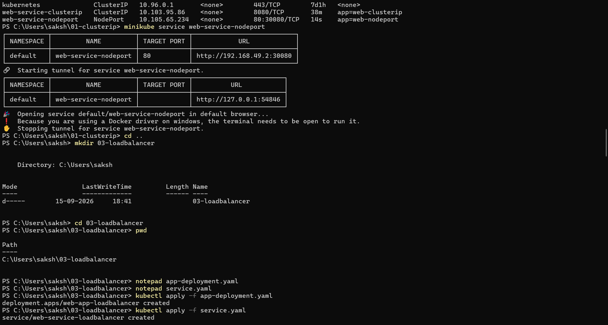
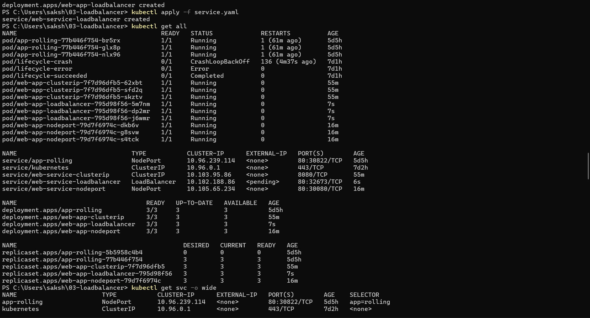
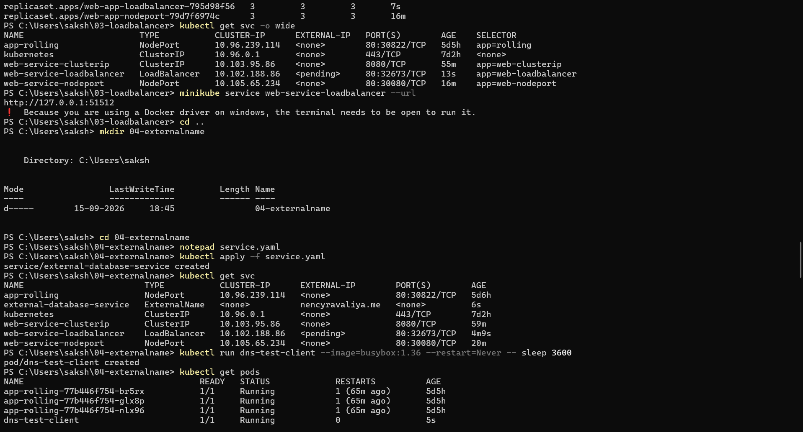
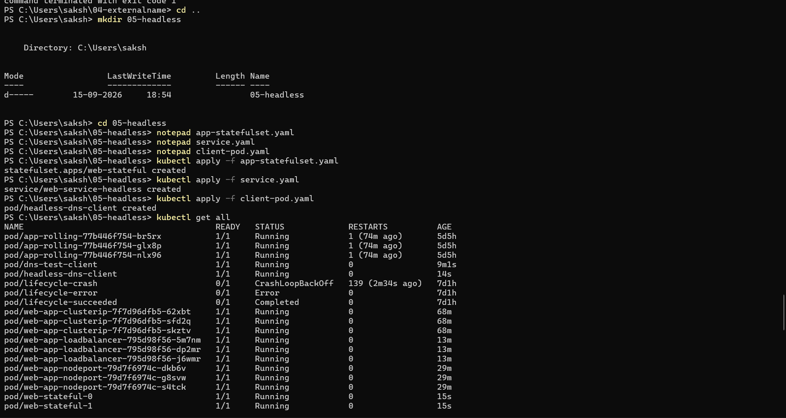
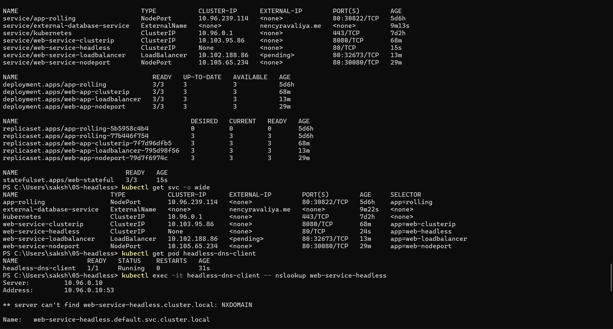
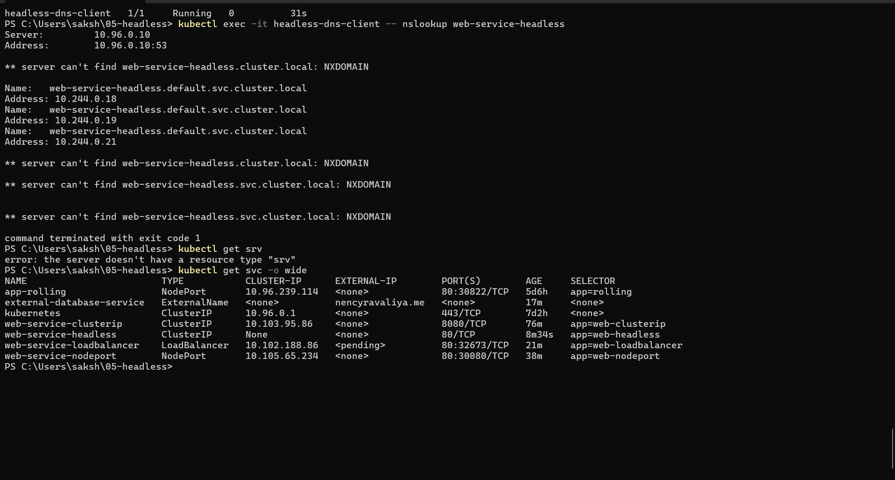

# Kubernetes Services

## Session 11: Kubernetes Services

In this session, I practiced the five main Kubernetes Service types using Minikube with the Docker driver. I created workloads, exposed them with different Service types, and verified service discovery, DNS resolution, and application access.

## Resources Covered

1. [ClusterIP](01-clusterip/README.md) - Internal communication using a stable virtual IP and DNS name.
2. [NodePort](02-nodeport/README.md) - External access through a port opened on the Kubernetes node.
3. [LoadBalancer](03-loadbalancer/README.md) - Public-style access through a load balancer. In Minikube, the external IP remains pending unless a tunnel is running.
4. [ExternalName](04-externalname/README.md) - DNS alias from a Kubernetes Service to an external hostname.
5. [Headless Service](05-headless/README.md) - Direct DNS-based discovery of StatefulSet pod IP addresses.

## 1. ClusterIP Service

Created a three-replica NGINX Deployment and exposed it internally with the `web-service-clusterip` ClusterIP Service. An in-cluster curl pod successfully accessed the NGINX page using the Service DNS name:

```bash
kubectl exec -it curl-client -- curl -s web-service-clusterip:8080
```





## 2. NodePort Service

Created a NodePort Service named `web-service-nodeport`. Kubernetes exposed port `80` through node port `30080`, and Minikube provided a reachable URL using the service command:

```bash
minikube service web-service-nodeport
```




## 3. LoadBalancer Service

Created a LoadBalancer Service named `web-service-loadbalancer`. In the local Minikube Docker environment, the Service was created successfully, but its `EXTERNAL-IP` remained `<pending>` because no cloud load balancer was available.

```bash
kubectl get svc web-service-loadbalancer
minikube service web-service-loadbalancer --url
```




## 4. ExternalName Service

Created the `external-database-service` ExternalName Service and configured it to resolve to `nencyravaliya.me`. The Service has no ClusterIP or selector; CoreDNS provides the external DNS alias.

```bash
kubectl get svc external-database-service
```



## 5. Headless Service

Created a Headless Service with `clusterIP: None` for a three-replica StatefulSet. DNS lookup returned the individual pod addresses instead of one virtual ClusterIP.

```bash
kubectl exec -it headless-dns-client -- nslookup web-service-headless
kubectl get svc web-service-headless -o wide
```




## Useful Verification Commands

```bash
kubectl get pods
kubectl get svc -o wide
kubectl get endpoints
kubectl get statefulset
```

## Key Takeaways

- `ClusterIP` is used for internal Service communication.
- `NodePort` exposes a Service through a port on every node.
- `LoadBalancer` is intended for cloud-provider external access.
- `ExternalName` creates a DNS CNAME alias and does not create endpoints.
- A Headless Service returns the IP addresses of matching pods directly.
