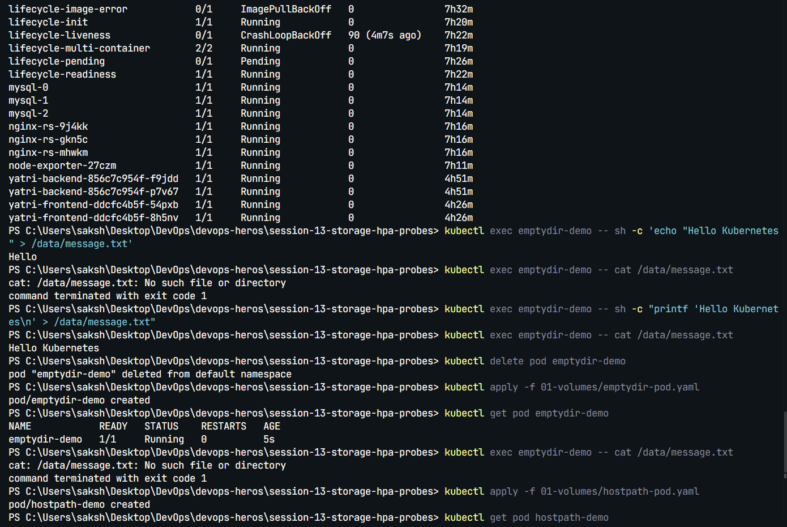
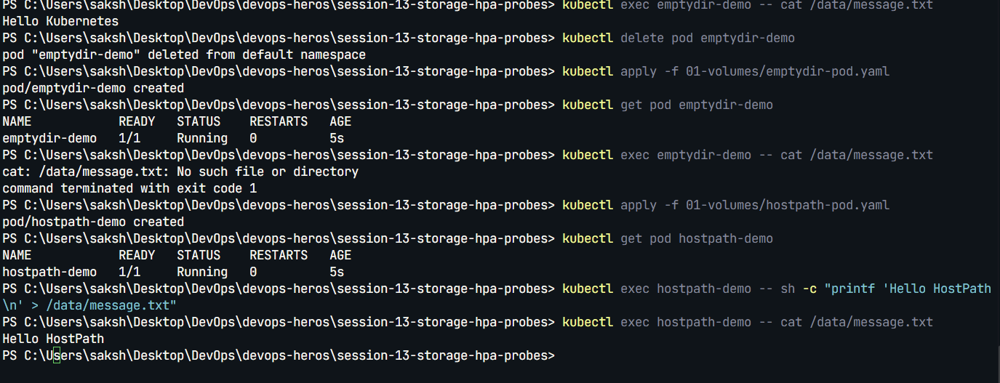
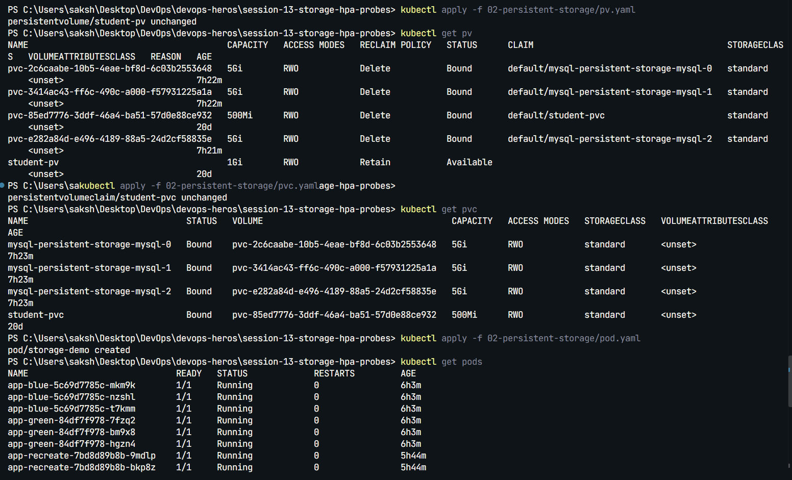
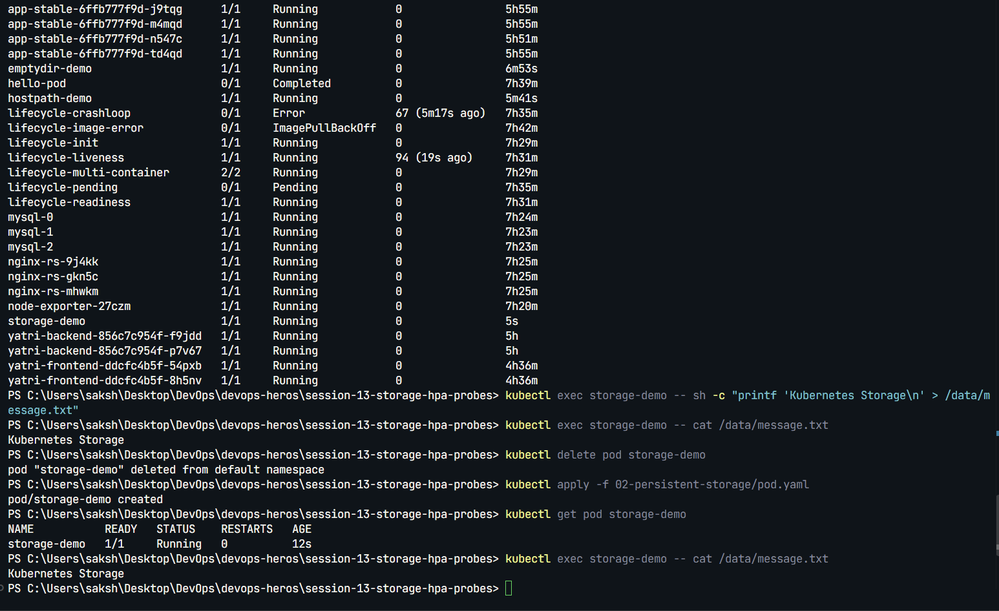
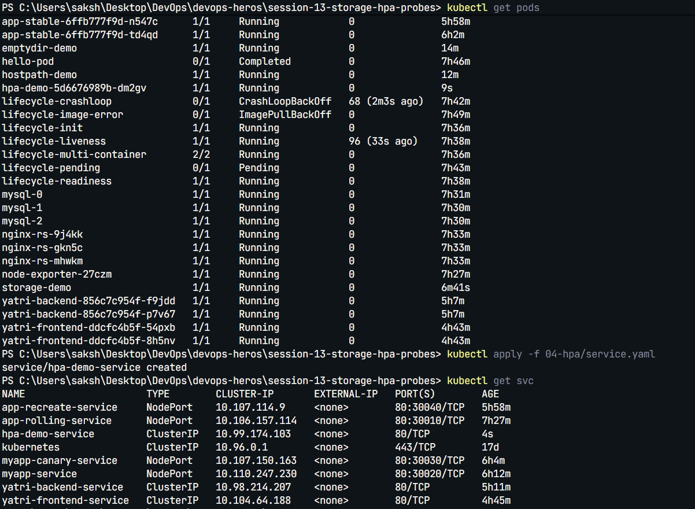
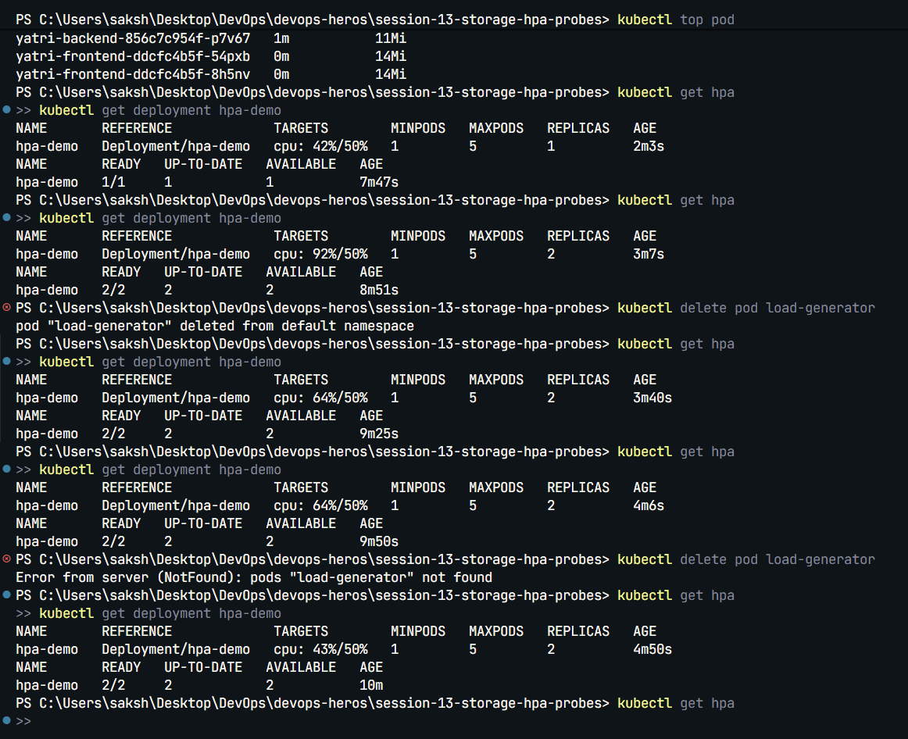
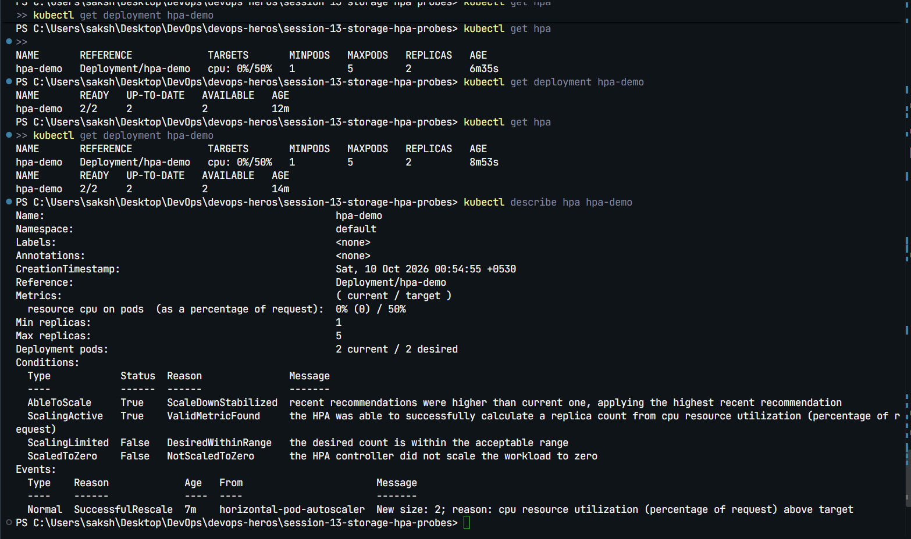
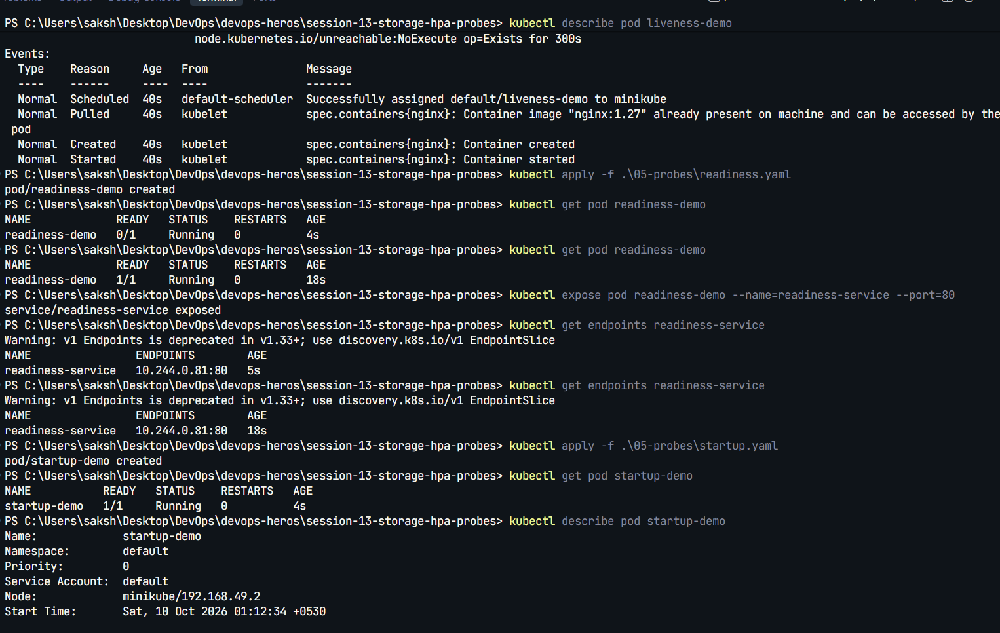
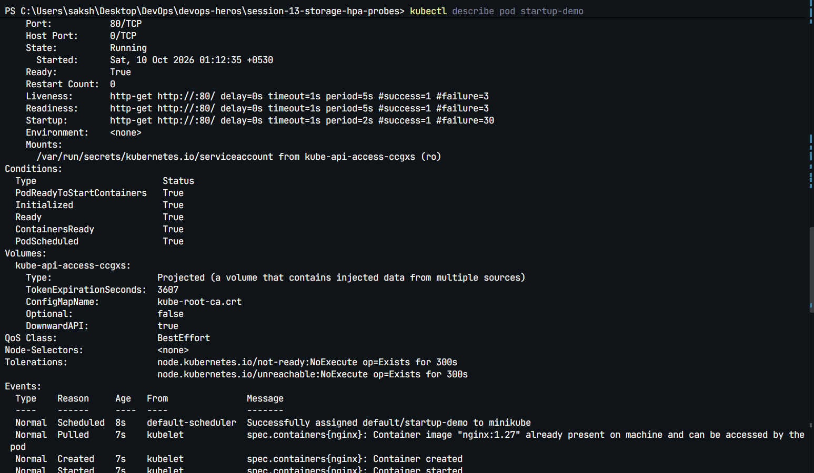

# Session 13: Kubernetes Storage, HPA, and Probes

## Homework tasks completed

1. **Volumes and persistent storage:** documented and deployed `emptyDir`, `hostPath`, a manual PV/PVC pair, and a dynamically provisioned PVC. The manual PVC uses the explicit `manual` StorageClass to bind to `student-pv`.
2. **HPA:** deployed an Nginx workload, Service, CPU-based HPA, and BusyBox load generator. Metrics Server was enabled on Minikube; load exceeded the 50% CPU target and the HPA scaled the Deployment to two replicas.
3. **Mini project and probes:** deployed the `production-webapp` namespace, PVC, Service, two-replica Deployment, startup/readiness/liveness probes, and HPA.

## Evidence

### Task 1: Volumes and Persistent Storage

**Volume examples (`emptyDir` and `hostPath`)**



**StorageClass, dynamic PVC, and PV/PVC verification**



**Manual PV/PVC and storage Pod**



**Persistent data verification**



### Task 2: Horizontal Pod Autoscaling

**HPA and Service setup**



**CPU load and replica scaling**



**HPA status after the load test**



### Task 3: Probes and Mini Project

**Probe configuration and Pod checks**



**Probe verification**



Mini-project manifests: [`mini-project/`](mini-project/)

## Commands used

```bash
kubectl apply -f 01-volumes/
kubectl apply -f 02-persistent-storage/
kubectl get pv,pvc,pods
kubectl get hpa
kubectl top pods
kubectl describe hpa hpa-demo
```

The implementation files are organized by topic under `01-volumes/` through `05-probes/` and `mini-project/`.