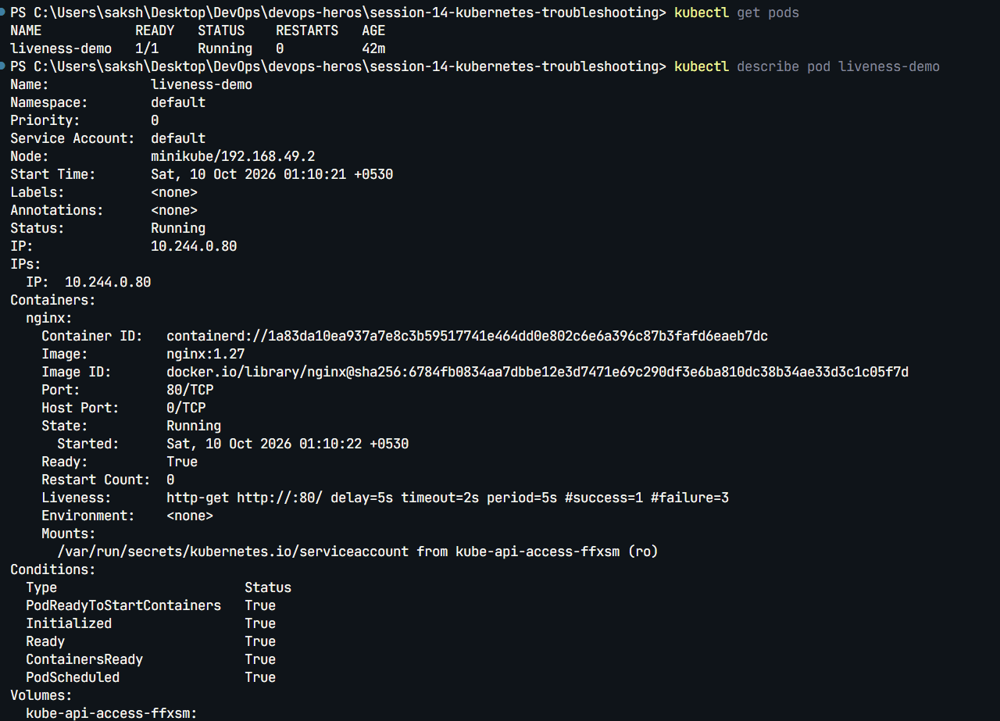
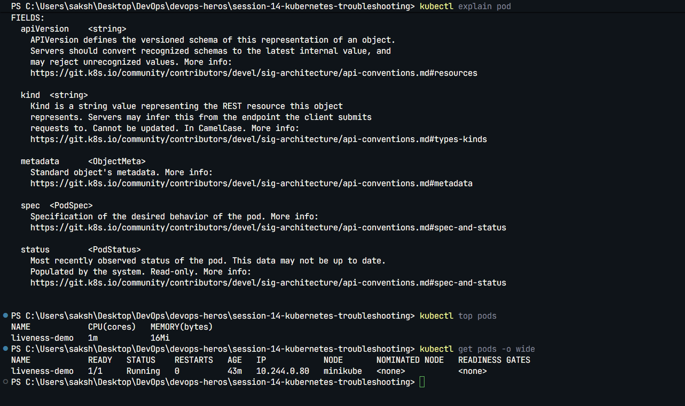
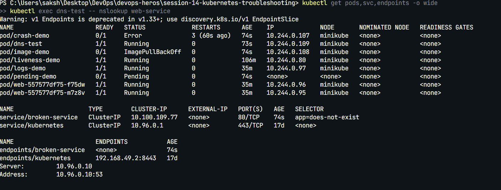
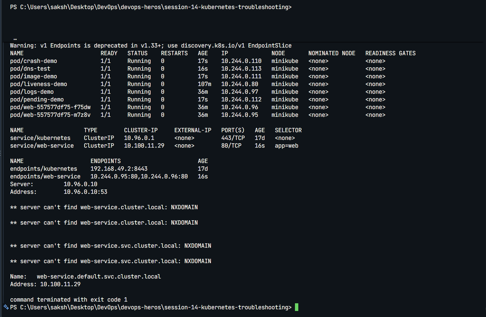
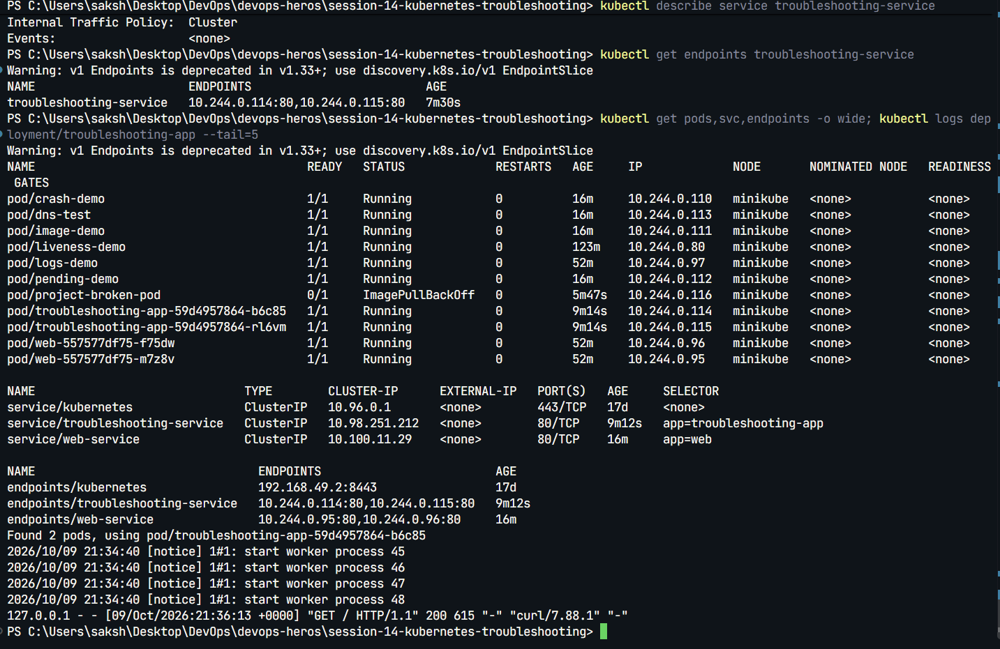

# Session 14: Kubernetes Troubleshooting Homework

## Task 1 - Troubleshooting commands

Practiced `kubectl get`, `describe`, `logs`, `exec`, `events`, `explain`, `top`, and `get -o wide` while investigating Kubernetes workloads, Services, and endpoints.

  

## Task 2 - Common issues

The following scenarios were intentionally broken, investigated, fixed, and verified:

- CrashLoopBackOff caused by a container command exiting with an error.
- ImagePullBackOff caused by a nonexistent image tag.
- Pending Pod caused by a scheduling constraint.
- Service connectivity failure caused by a selector with no matching Pod labels.
- DNS test failure caused by the test setup.

  

## Task 3 - Mini project

The mini project deployed an Nginx application with a Service alongside an intentionally broken image. I investigated the Pod, corrected the image configuration, and verified the recovered resources.

Project files: [`mini-project/`](mini-project/)

