# Session 15: Helm Homework

## Task 1 - Helm commands

Used `helm lint`, `template`, `install`, `list`, `status`, `get values`, `upgrade`, `history`, and `rollback` with the Notes chart mini project.

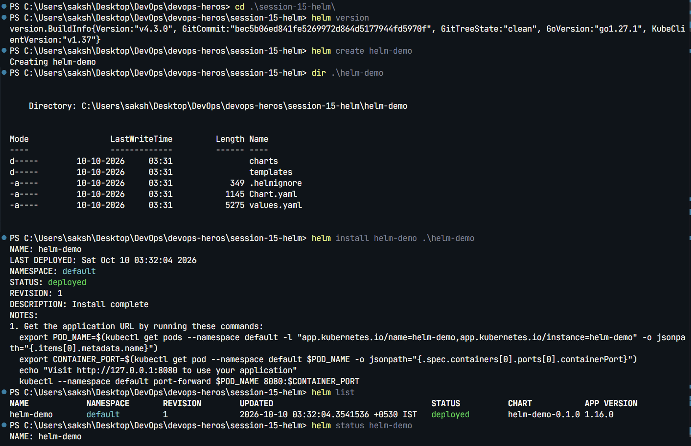

  

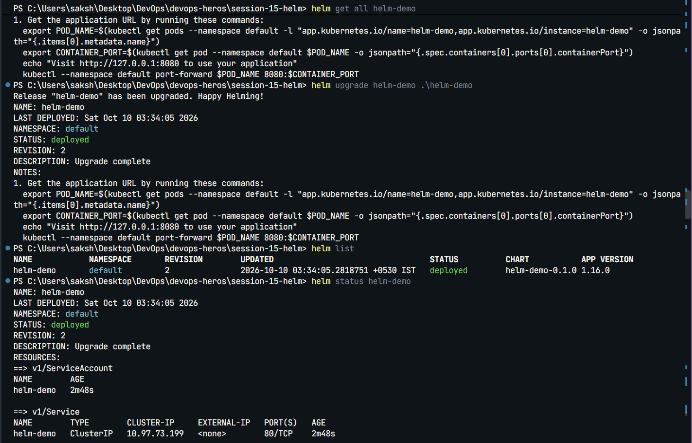

  

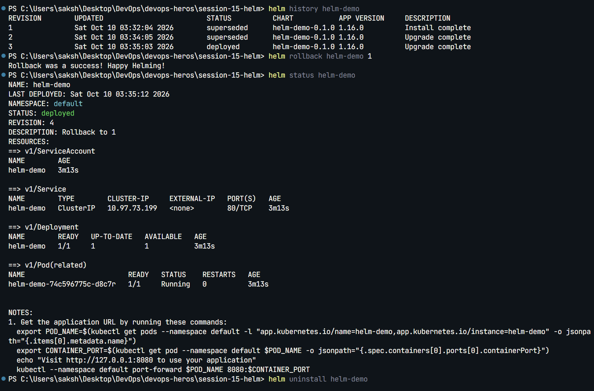

  

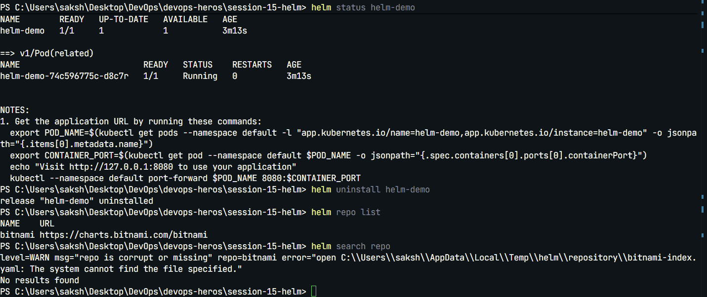

## Task 2 - Rollback workflow

Completed the workflow: install, upgrade, verify, upgrade with a broken image tag, inspect release history, roll back to the healthy revision, and verify. Helm history shows the deployed and superseded revisions.

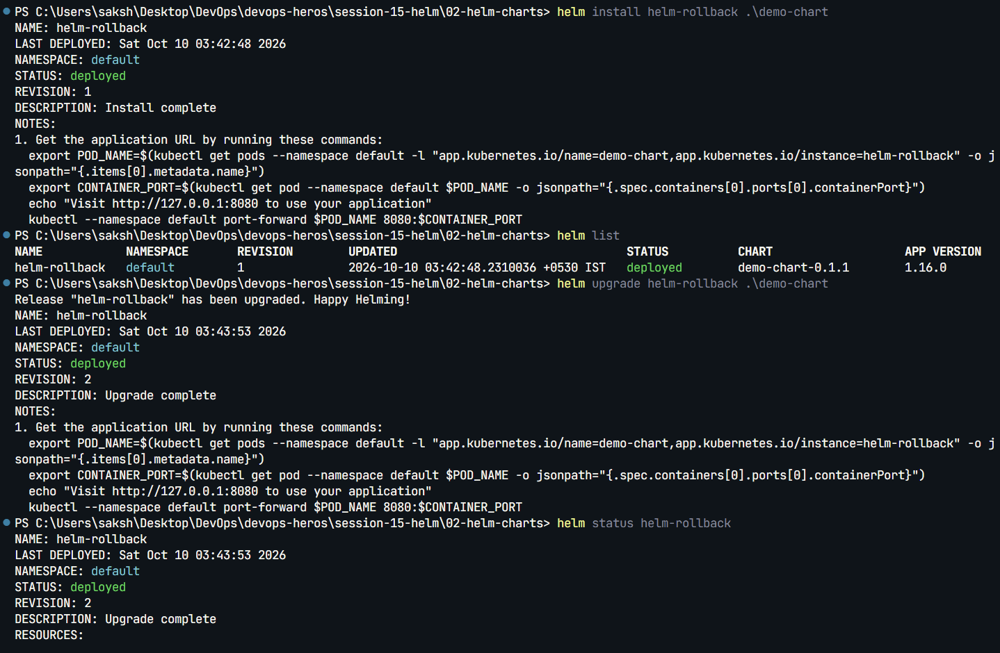

  

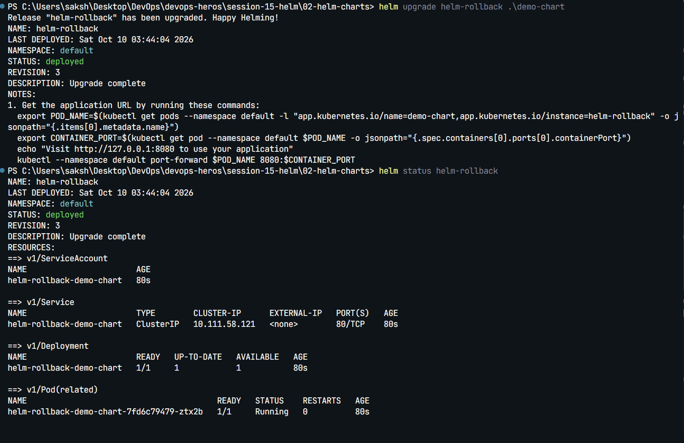

  

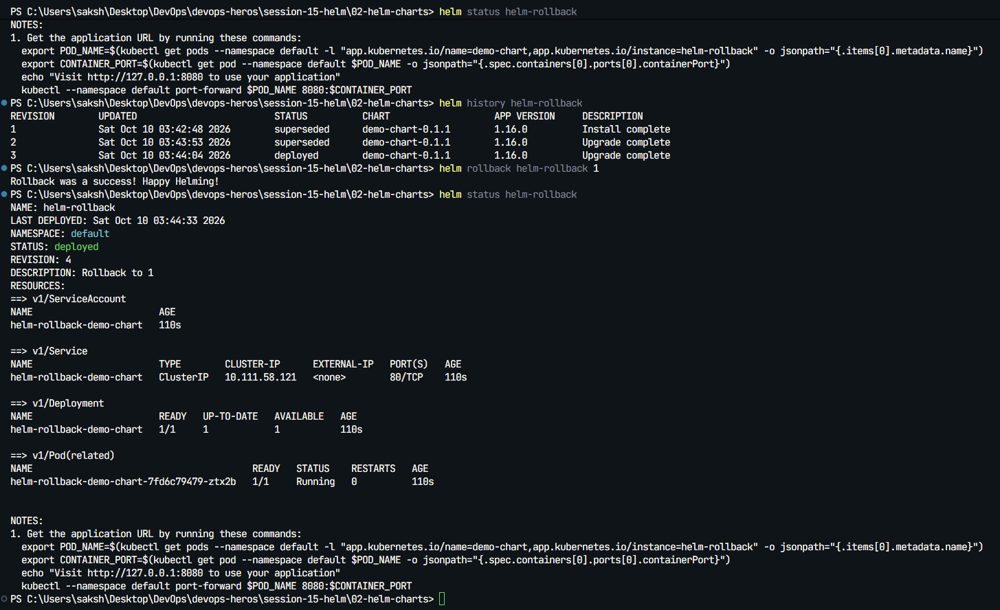

## Task 3 - Mini project

The Notes chart passed `helm lint`. The release was installed, upgraded with production values, rolled back, and its Kubernetes resources were verified. Chart files are in [`mini-project/notes-chart/`](mini-project/notes-chart/).

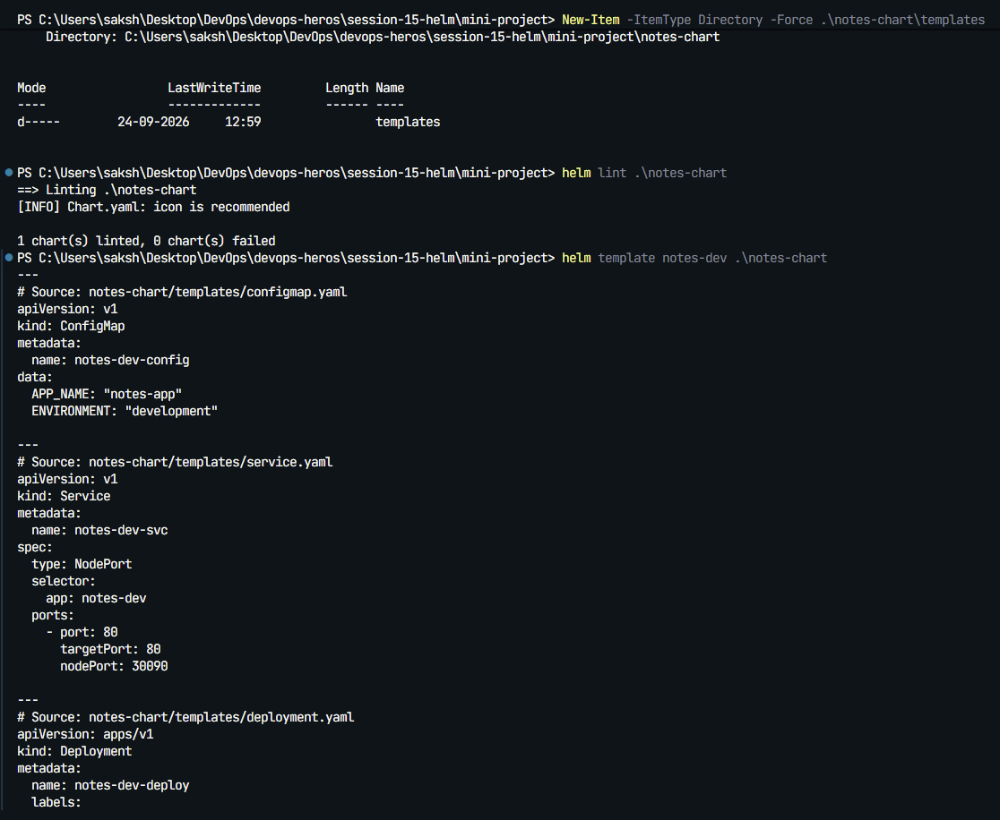

  

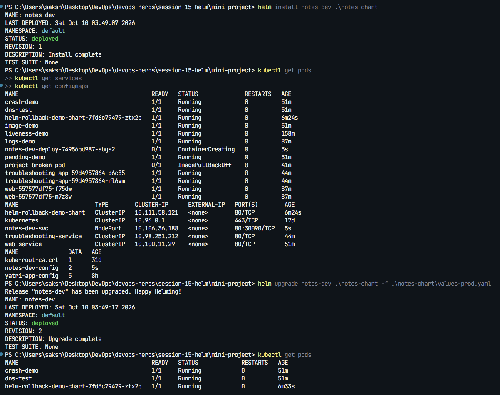

  

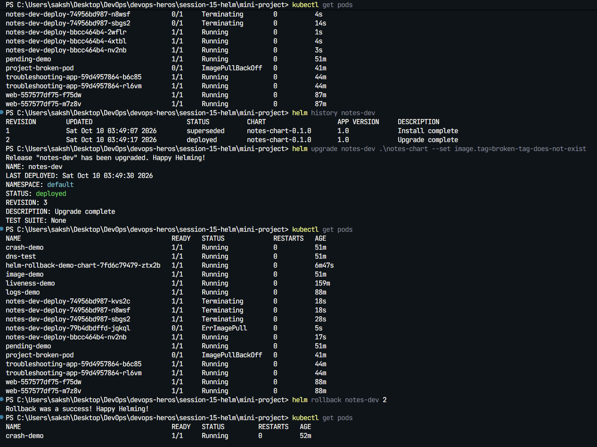

  

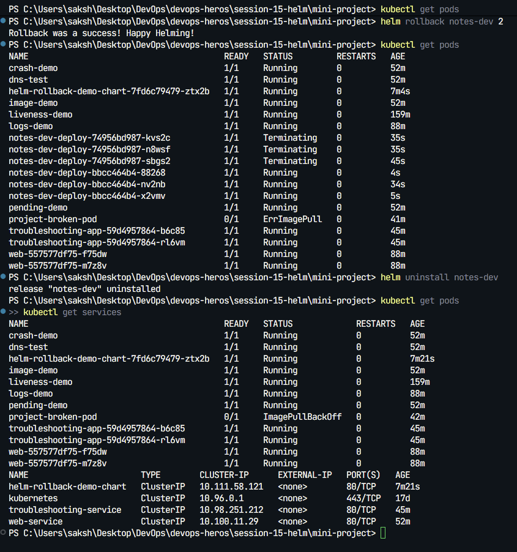
