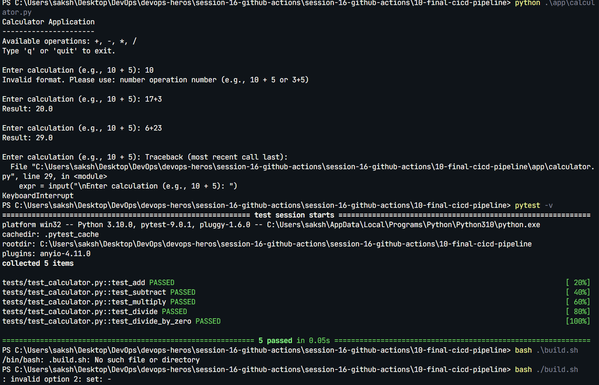
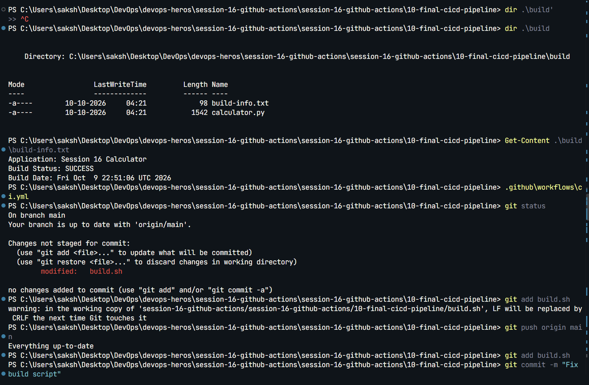
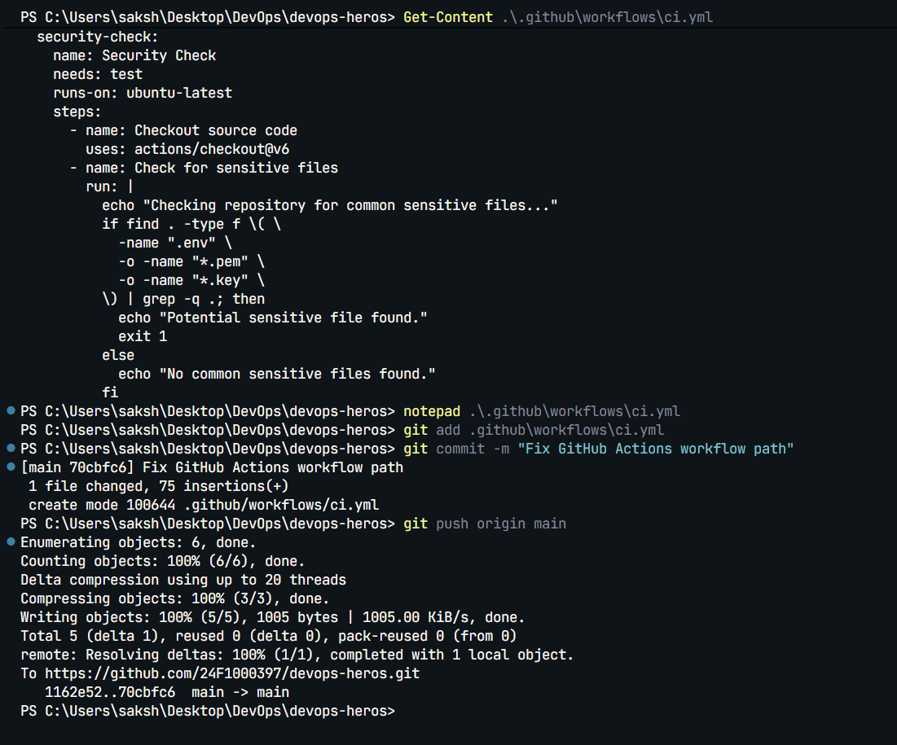
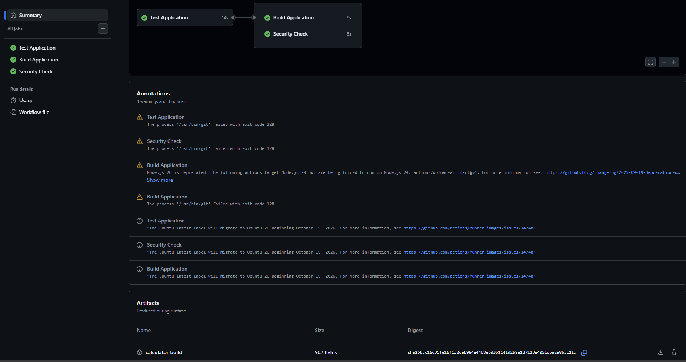

# Session 16: CI/CD and GitHub Actions

## Homework demo

The final demo is in [`session-16-github-actions/10-final-cicd-pipeline/`](session-16-github-actions/10-final-cicd-pipeline/). It contains a Python calculator, tests, build script, Dockerfile, and GitHub Actions workflow.

The workflow covers CI (checkout, dependency installation, tests, security check, build, and artifact upload). The Dockerfile is included for containerizing the calculator.

## Local verification

- 5 calculator tests passed.
- The build generates the `calculator-build` artifact.

## Workflow file

[`ci.yml`](session-16-github-actions/10-final-cicd-pipeline/.github/workflows/ci.yml) runs on GitHub Actions.
