# Session 10: Kubernetes Core Objects, Lifecycle & Deployment Strategies

---

## Task 1: Minikube Setup and Kubernetes Version Checks

- **Description:** Start the local Minikube cluster and verify the installed Kubernetes client and cluster versions.
- **Commands Run:**

  ```powershell
  minikube start
  kubectl version --output=yaml
  kubectl cluster-info
  ```

### Solution / Observation

The screenshots show Minikube `v1.39.0`, kubectl client `v1.36.1`, and Kubernetes `v1.37.0`. Minikube started using the Docker driver.

### Screenshot

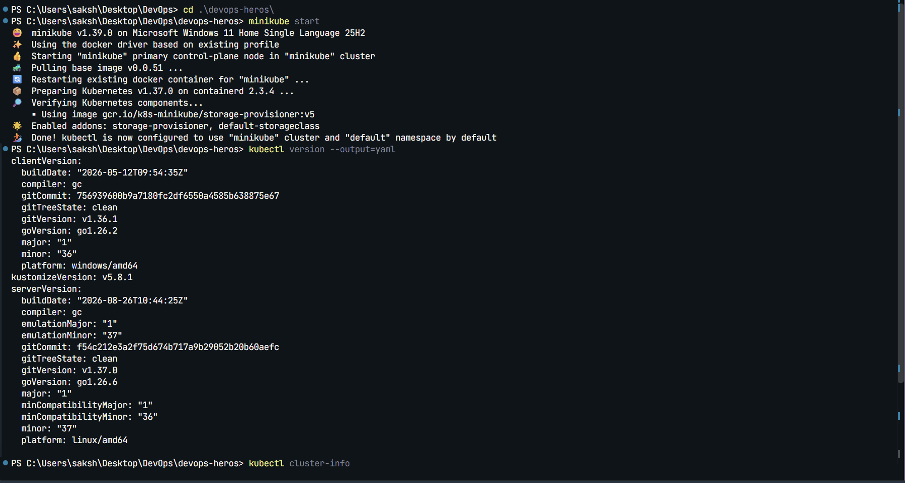

<br><br>

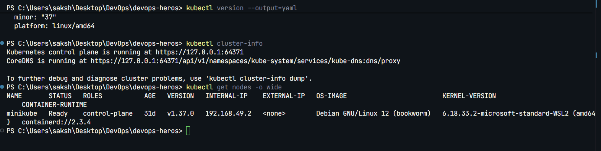

---

## Task 2: Deploying and Inspecting an NGINX Pod

- **Description:** Create a standalone NGINX Pod and inspect its status, node assignment, and container logs.
- **File Reference:** [`pod.yml`](pod.yml)
- **Commands Run:**

  ```powershell
  kubectl apply -f pod.yml
  kubectl get pods
  kubectl get pods -o wide
  kubectl logs nginx-pod
  ```

### Solution / Observation

The manifest creates the `nginx-pod` Pod. The screenshots show Kubernetes accepting the Pod and its container starting; the logs show the NGINX startup output. A newly created Pod can briefly show `ContainerCreating` before it becomes ready.

### Screenshot

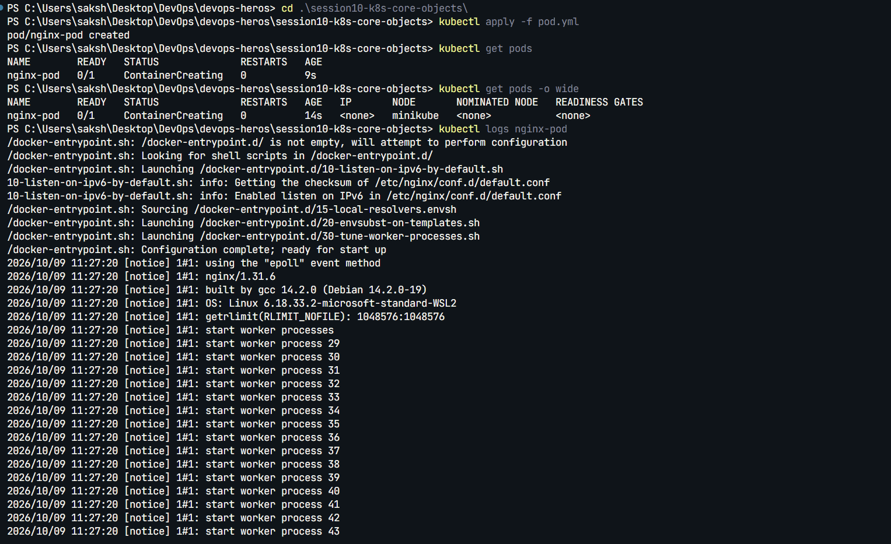

<br><br>

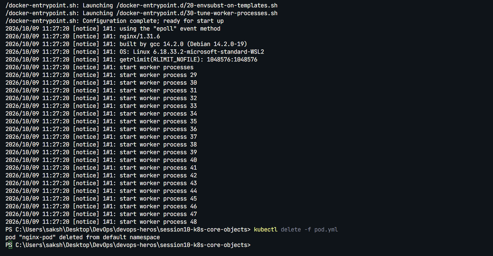

---

## Task 3: Inspecting an Image Pull Failure

- **Description:** Apply a Pod configured with a nonexistent image and inspect the resulting image-pull error.
- **File Reference:** [`pod-lifecycle/06-imagepullbackoff.yaml`](pod-lifecycle/06-imagepullbackoff.yaml)
- **Commands Run:**

  ```powershell
  kubectl apply -f pod-lifecycle/06-imagepullbackoff.yaml
  kubectl get pod lifecycle-image-error
  kubectl describe pod lifecycle-image-error
  ```

### Solution / Observation

Kubernetes accepts the Pod specification, but the container cannot start because its image cannot be pulled. The observed container waiting reason is `ErrImagePull`; Kubernetes retries and can report `ImagePullBackOff`.

### Screenshot

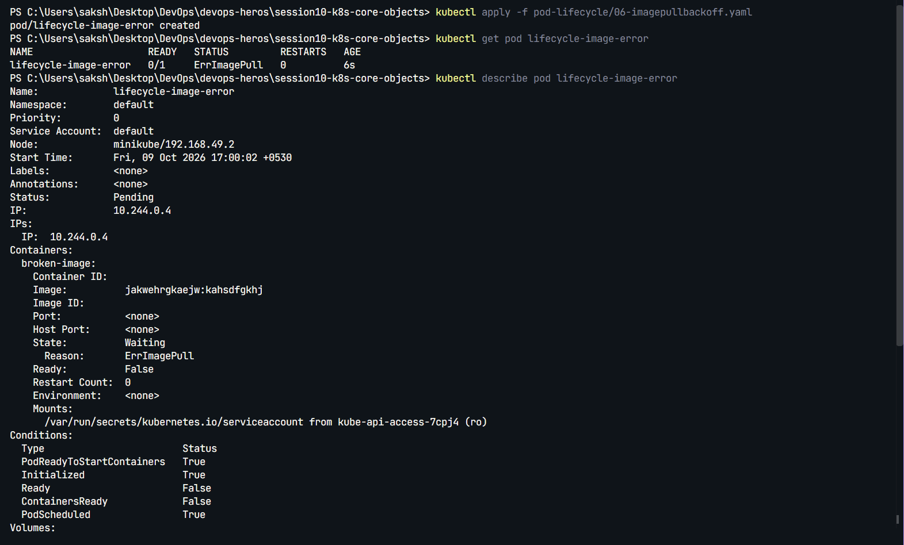

<br><br>

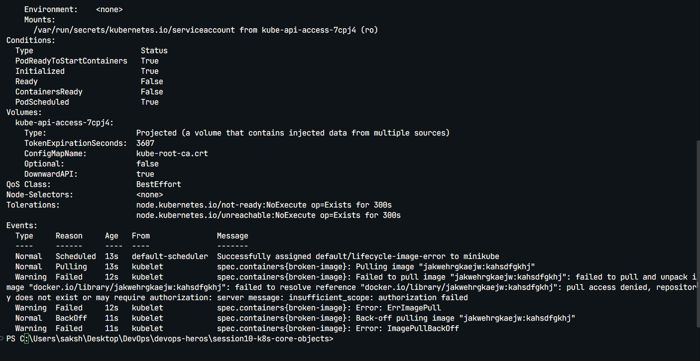

---

## Task 4: Inspecting a Pending Pod

- **Description:** Deploy a Pod with resource requests that cannot be satisfied by the local cluster and inspect why it remains Pending.
- **File Reference:** [`pod-lifecycle/02-pending.yaml`](pod-lifecycle/02-pending.yaml)
- **Commands Run:**

  ```powershell
  kubectl apply -f pod-lifecycle/02-pending.yaml
  kubectl describe pod lifecycle-pending
  ```

### Solution / Observation

The Pod remains `Pending` because Kubernetes cannot schedule it with the requested resources. The `Events` section of `kubectl describe` provides scheduling details.

### Screenshot

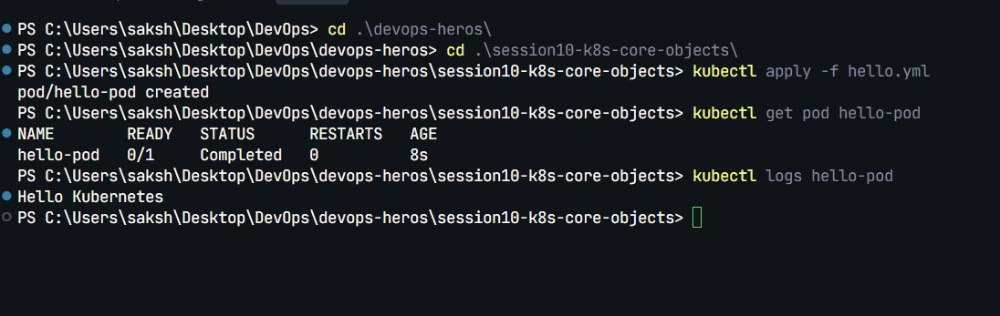

<br><br>

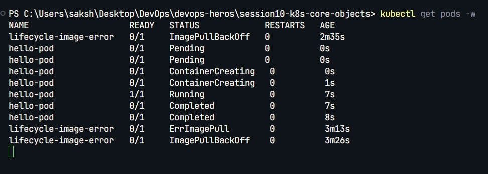

---

## Task 5: Running a Short-Lived Pod

- **Description:** Run the short-lived `hello-pod`, confirm it completes, and inspect its output.
- **File Reference:** [`hello.yml`](hello.yml)
- **Commands Run:**

  ```powershell
  kubectl apply -f hello.yml
  kubectl get pod hello-pod
  kubectl logs hello-pod
  ```

### Solution / Observation

The Pod runs its command and exits successfully. Its displayed status is `Completed`, and the logs show `Hello Kubernetes`.

### Screenshot

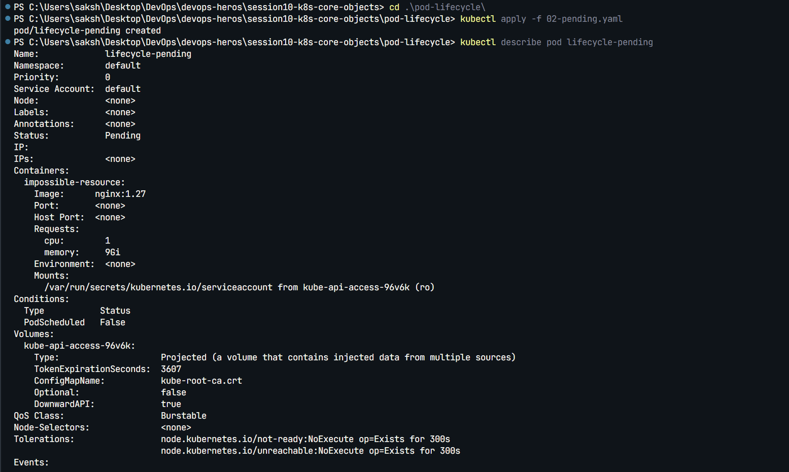

<br><br>

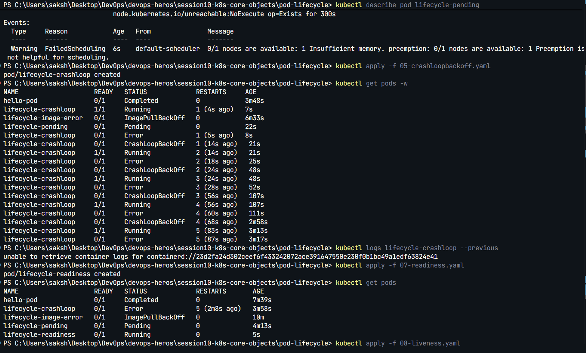

<br><br>

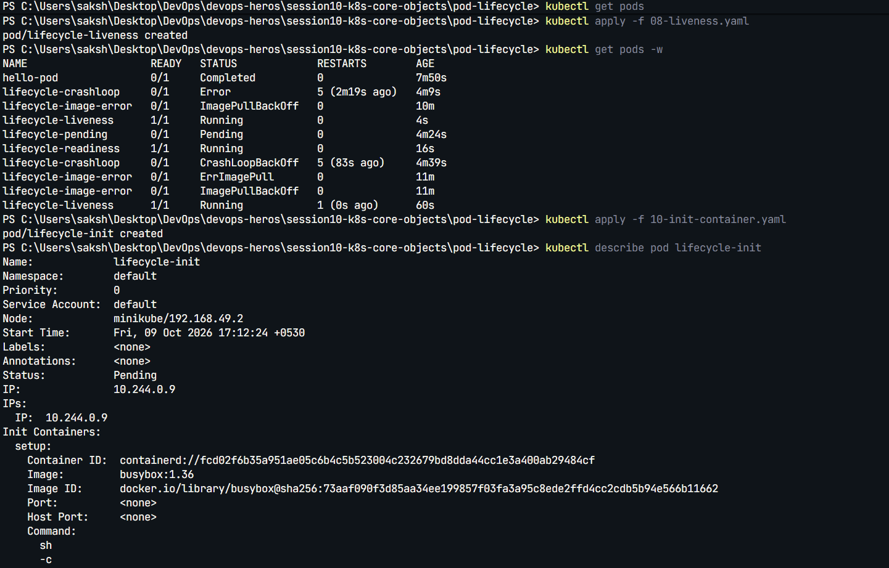

<br><br>

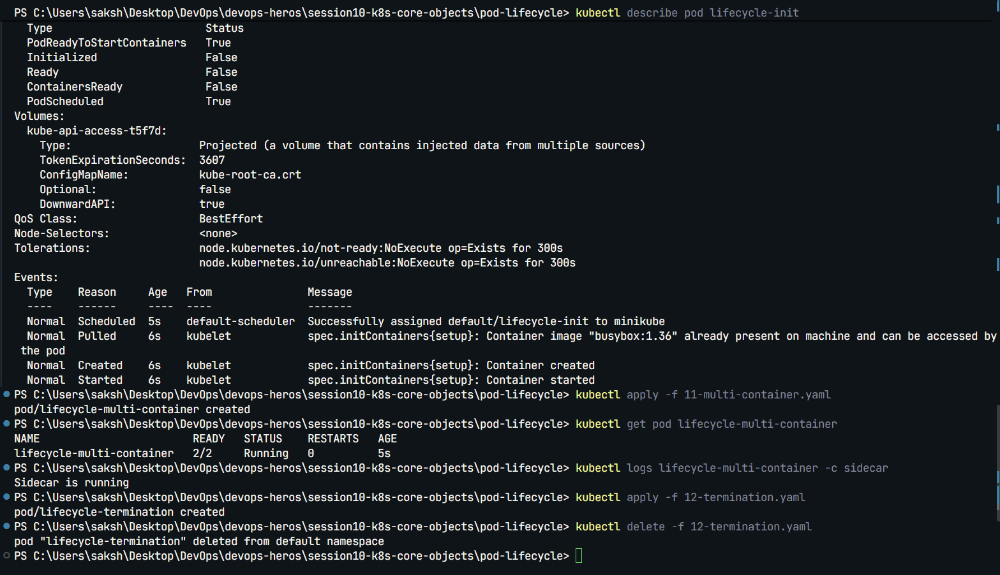

---

## Task 6: Creating a ReplicaSet

- **Description:** Create a ReplicaSet and check that it maintains the requested three NGINX Pod replicas.
- **File Reference:** [`replicaset.yml`](replicaset.yml)
- **Commands Run:**

  ```powershell
  kubectl apply -f replicaset.yml
  kubectl get rs
  kubectl get pods -l app=nginx
  ```

### Solution / Observation

The screenshot shows the `nginx-rs` ReplicaSet with three desired, current, and ready replicas. A ReplicaSet replaces a matching Pod if one is removed, maintaining the configured count.

### Screenshot

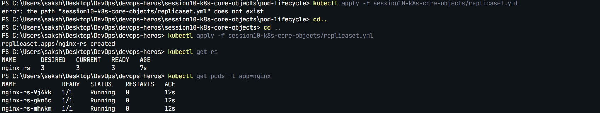

<br><br>

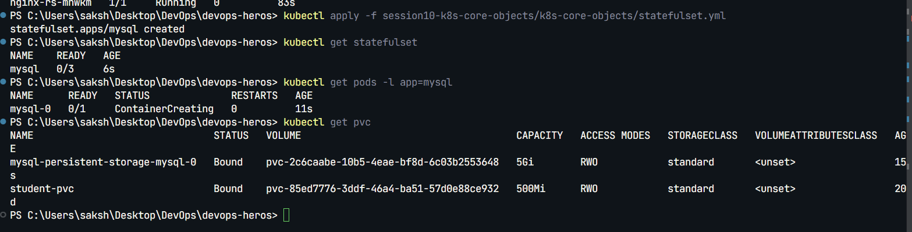

---

## Task 7: Performing a Rolling Update

- **Description:** Deploy the first version of an application, update it, and inspect the rollout progress and revision history.
- **File References:** [`01-rolling-update/deployment-v1.yaml`](01-rolling-update/deployment-v1.yaml), [`01-rolling-update/deployment-v2.yaml`](01-rolling-update/deployment-v2.yaml), and [`01-rolling-update/service.yaml`](01-rolling-update/service.yaml)
- **Commands Run:**

  ```powershell
  kubectl apply -f 01-rolling-update/deployment-v1.yaml
  kubectl apply -f 01-rolling-update/service.yaml
  kubectl rollout status deployment/app-rolling
  kubectl apply -f 01-rolling-update/deployment-v2.yaml
  kubectl rollout status deployment/app-rolling
  kubectl get pods -l app=app-rolling -w
  kubectl rollout history deployment/app-rolling
  ```

### Solution / Observation

The screenshot shows the Deployment progressing to four available replicas and a rollout history with revisions. A rolling update replaces Pods incrementally rather than stopping the full workload at once.

### Screenshot

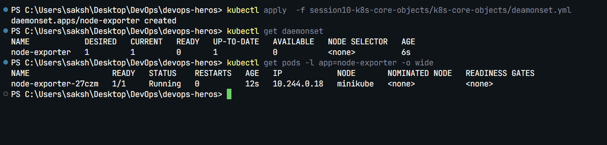

For the full procedure, see the [rolling update notes](01-rolling-update/README.md).

---

## Task 8: Troubleshooting a Failed Deployment

- **Description:** Deploy a workload with a broken image and inspect the stalled rollout and Pod status.
- **File Reference:** [`troubleshooting/broken-image.yaml`](troubleshooting/broken-image.yaml)
- **Commands Run:**

  ```powershell
  kubectl apply -f troubleshooting/broken-image.yaml
  kubectl rollout status deployment/yatri-backend --timeout=30s
  kubectl get pods -l app=yatri-backend
  ```

### Solution / Observation

The rollout times out because the new Pods cannot pull their configured image. The observed Pods report `ErrImagePull`, demonstrating how a container image problem can prevent a Deployment from becoming available.

### Screenshot

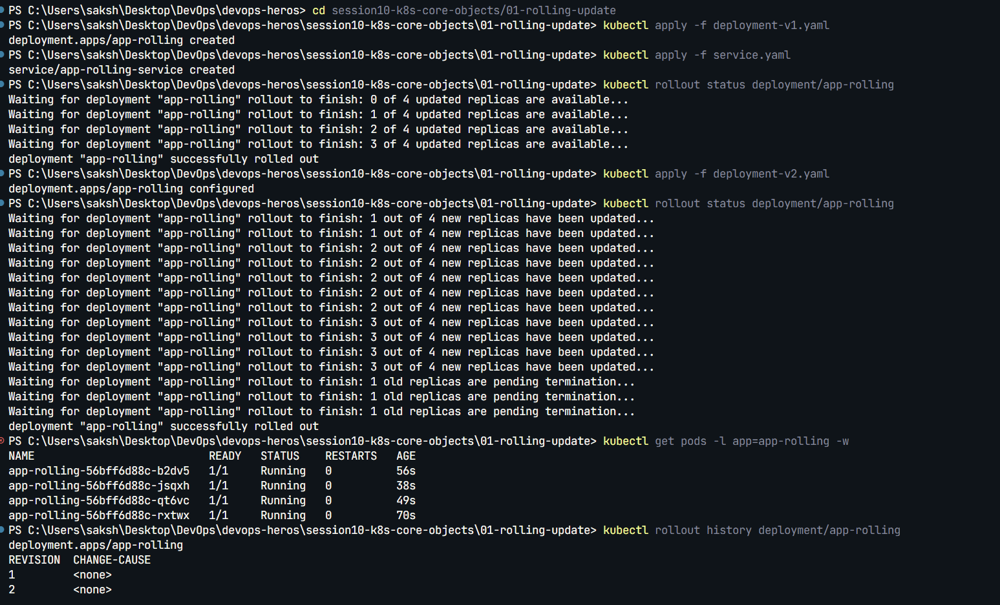

<br><br>

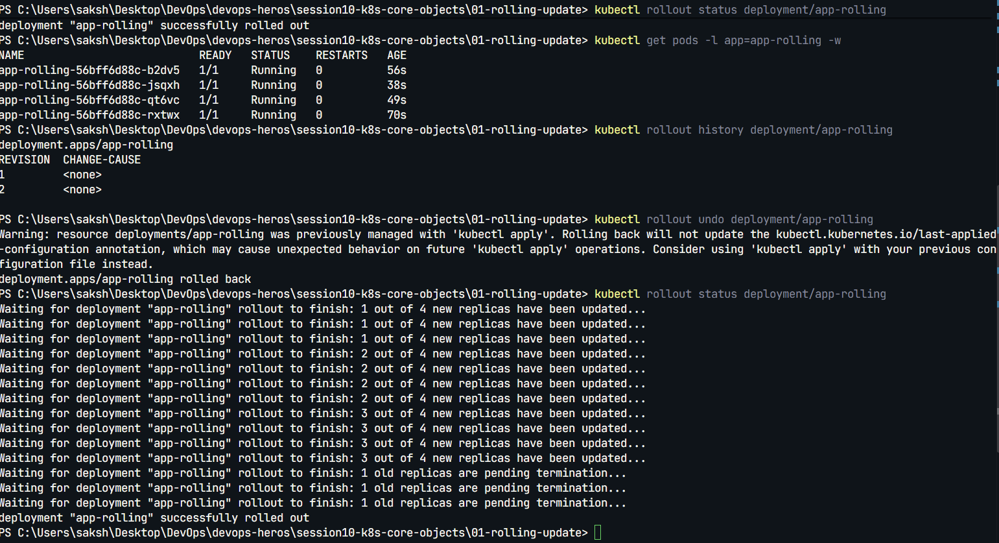

---

## Task 9: Creating and Checking a Blue-Green Deployment

- **Description:** Deploy Blue and Green application versions and inspect the Pods, Service selector, and endpoints for the active version.
- **File References:** [`02-blue-green/deployment-blue.yaml`](02-blue-green/deployment-blue.yaml), [`02-blue-green/deployment-green.yaml`](02-blue-green/deployment-green.yaml), [`02-blue-green/service-blue.yaml`](02-blue-green/service-blue.yaml), and [`02-blue-green/service-green.yaml`](02-blue-green/service-green.yaml)
- **Commands Run:**

  ```powershell
  kubectl apply -f 02-blue-green/deployment-blue.yaml
  kubectl apply -f 02-blue-green/deployment-green.yaml
  kubectl apply -f 02-blue-green/service-blue.yaml
  kubectl get pods -l app=myapp --show-labels
  kubectl describe svc myapp-service
  kubectl get endpoints myapp-service
  ```

### Solution / Observation

The deployments use labels to distinguish the Blue and Green versions. The Service selector determines which version receives traffic. Switching from the Blue Service manifest to the Green Service manifest changes the selector; applying the Blue manifest again switches back.

### Screenshot

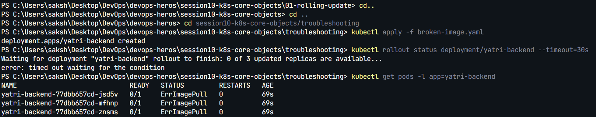

<br><br>

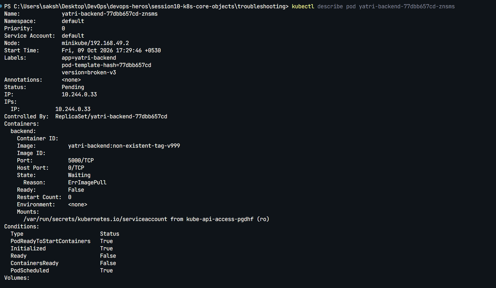

<br><br>

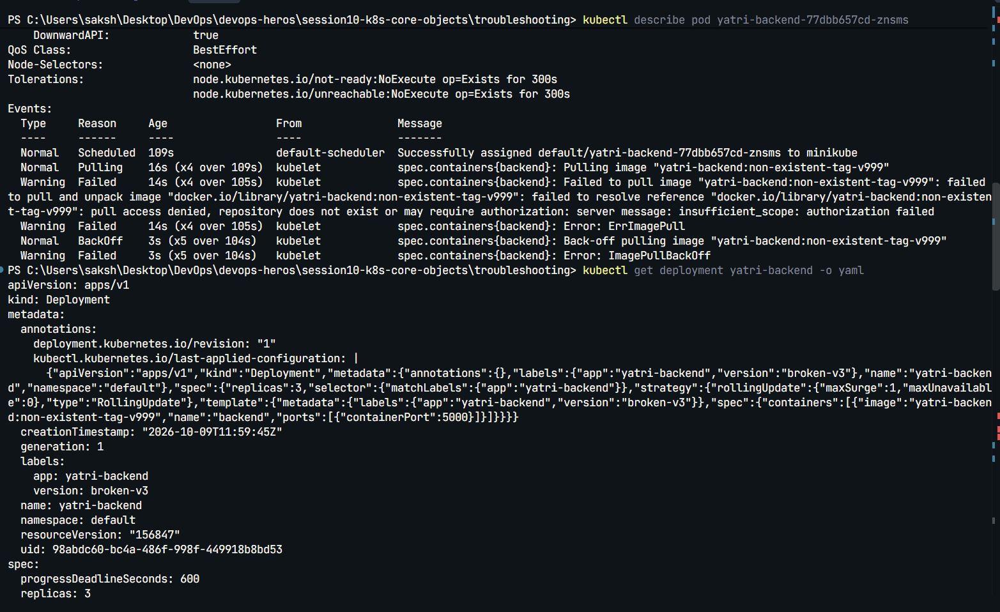

<br><br>

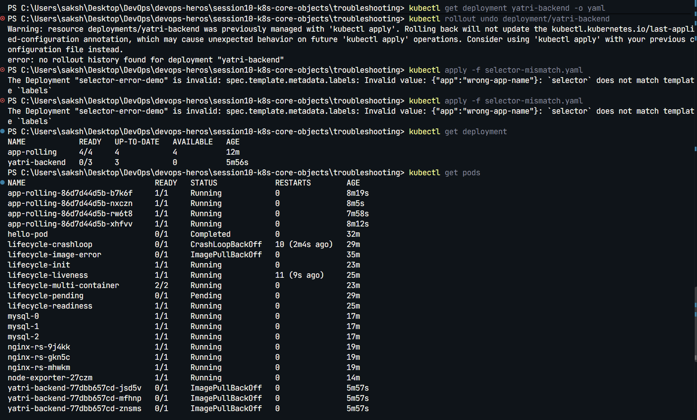

See the [Blue-Green notes](02-blue-green/README.md) for the traffic switch and rollback procedure.

---

## Task 10: Theoretical and Architectural Conceptual Writeup

- **Description:** Explain Kubernetes Service ports, labels and selectors, Deployment strategies, rollout capacity settings, and resource requests and limits.

### Solution / Observation

#### 1. Understanding the Four Service and Container Ports

These port fields describe different points along the traffic path; they are not interchangeable.

| Field | Meaning |
|---|---|
| `containerPort` | Documents a port that the application container is expected to listen on. It is part of the Pod specification and does not itself open a port or configure the application. |
| `targetPort` | The port on the selected Pod/container where the Service forwards traffic. |
| `port` | The port exposed by the Service inside the cluster. Clients connect to this Service port, and the Service forwards to `targetPort`. |
| `nodePort` | A port exposed on each node's IP address for a NodePort Service. The default allocation range is `30000–32767`; clusters can configure a different range. |

For example, a client can connect to Service `port: 80`; the Service forwards to Pod `targetPort: 8080`. If the Service is `NodePort`, clients can also connect to a node IP on its `nodePort`.

#### 2. Labels vs. Selectors

- **Labels** are key-value metadata attached to Kubernetes objects, such as `app: nginx` or `env: prod`.
- **Selectors** are queries that match labels. Services use selectors to find Pods for traffic routing, while controllers such as Deployments and ReplicaSets use selectors to manage their Pods.

The selector's labels must match the labels on the intended Pod template; a mismatch can leave a Service without endpoints or prevent a controller from managing the intended Pods.

#### 3. Four Deployment Strategies

- **RollingUpdate:** Gradually replaces old Pods with new ones. With appropriate readiness checks and capacity, it can keep the application available during rollout.
- **Recreate:** Stops the old Pods before starting the new version. This causes downtime, but avoids running both versions at the same time.
- **Blue-Green:** Runs separate Blue and Green versions. A Service selector change switches traffic to the new version; switching it back provides a fast rollback. Both environments require additional compute capacity while running together.
- **Canary:** Runs a small number of new-version Pods alongside stable Pods so the new version can be evaluated before broader promotion. A basic Kubernetes Service distributes traffic across matching endpoints, so replica ratios produce an approximate—not exact—traffic split.

Related manifests and examples are in the [rolling update](01-rolling-update/README.md), [Recreate](04-recreate/README.md), [Blue-Green](02-blue-green/README.md), and [Canary](03-canary/README.md) notes.

#### 4. `maxSurge` vs. `maxUnavailable`

For a Deployment with `replicas: 4`, `maxSurge: 1`, and `maxUnavailable: 0`:

- **Maximum Pods during the rollout:** `4 + 1 = 5`. Kubernetes may create one extra Pod above the desired replica count.
- **Minimum available Pods during the rollout:** `4 - 0 = 4`. No desired replica may be unavailable due to the rollout.

This configuration aims to preserve all four available replicas while updating, provided the new Pods can become ready and the cluster has sufficient resources.

#### 5. Resource Requests, Limits, and Units

- **Requests** specify the amount of CPU and memory Kubernetes uses when scheduling a container onto a node. CPU requests also influence relative CPU allocation under contention; they are not a hard reservation of CPU time.
- **Limits** cap resource use. A CPU limit can cause throttling when exceeded. A container that exceeds its memory limit may be terminated with an out-of-memory (OOM) event.
- **Units:** `1 GB = 10^9` bytes (decimal/SI). `1 GiB = 2^30 = 1,073,741,824` bytes (binary/IEC). Kubernetes memory quantities commonly use `Mi` and `Gi`; CPU quantities can use cores or millicores, such as `500m` for half a CPU.

---

## Task 11: Verifying Blue-Green Traffic Selection

- **Description:** Compare Blue and Green application responses and verify which deployment is selected by the Service.
- **Commands to Run:**

  ```powershell
  kubectl apply -f 02-blue-green/service-blue.yaml
  kubectl describe svc myapp-service
  kubectl get endpoints myapp-service

  kubectl apply -f 02-blue-green/service-green.yaml
  kubectl describe svc myapp-service
  kubectl get endpoints myapp-service
  ```

### Solution / Observation

The Blue and Green manifests update the Service selector to the corresponding version labels. The endpoint list should contain Pods matching the active selector. Applying the Blue manifest again returns traffic to Blue.

### Screenshot

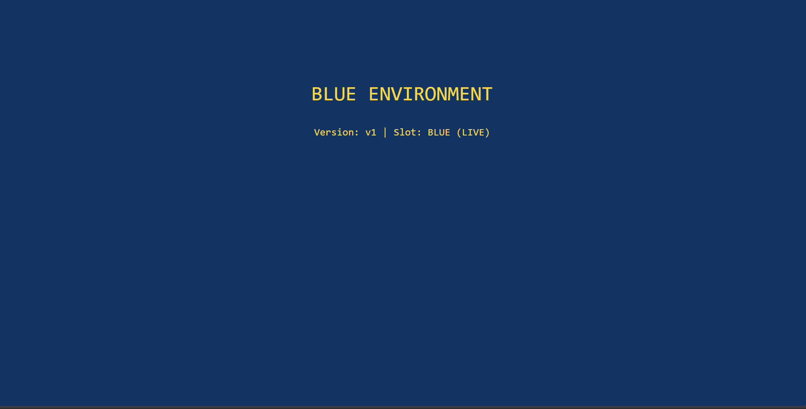

<br><br>

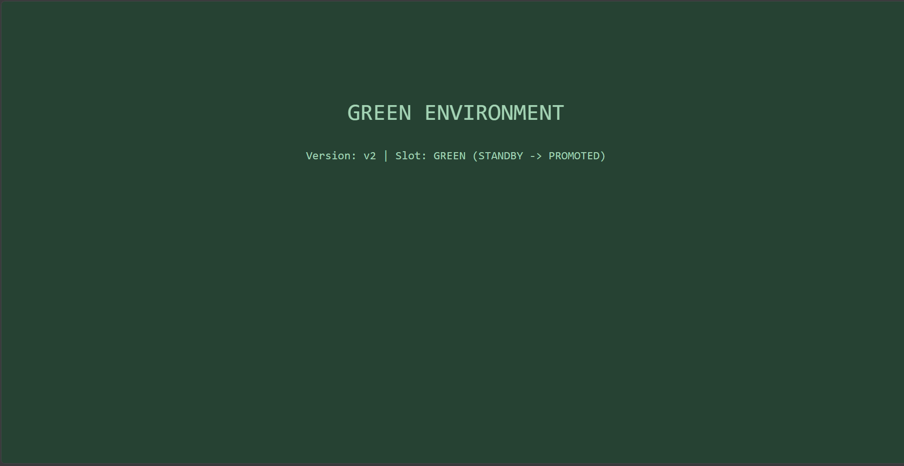

<br><br>

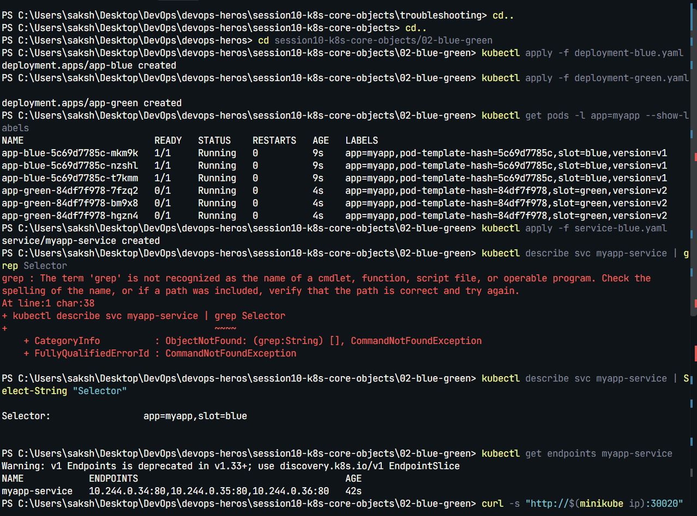

<br><br>

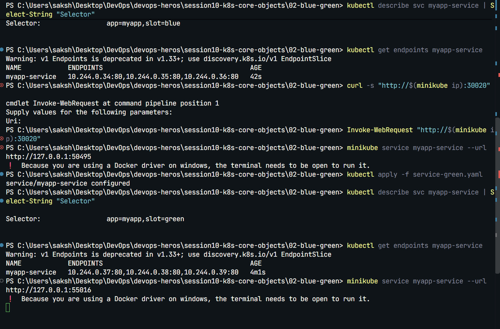

---

## Task 12: Recreate Deployment Strategy

- **Description:** Review a deployment strategy that stops the existing Pods before creating the replacement version, resulting in a downtime window.
- **File References:** [`04-recreate/deployment-v1.yaml`](04-recreate/deployment-v1.yaml), [`04-recreate/deployment-v2.yaml`](04-recreate/deployment-v2.yaml), and [`04-recreate/service.yaml`](04-recreate/service.yaml)
- **Commands to Run:**

  ```powershell
  kubectl apply -f 04-recreate/deployment-v1.yaml
  kubectl apply -f 04-recreate/service.yaml
  kubectl get pods -l app=app-recreate
  kubectl apply -f 04-recreate/deployment-v2.yaml
  kubectl rollout status deployment/app-recreate
  ```

### Solution / Observation

With the Recreate strategy, the old Pods are terminated before the new Pods are started. The application may be unavailable during that transition, so this strategy is suitable only when a temporary outage is acceptable or required.

### Screenshot

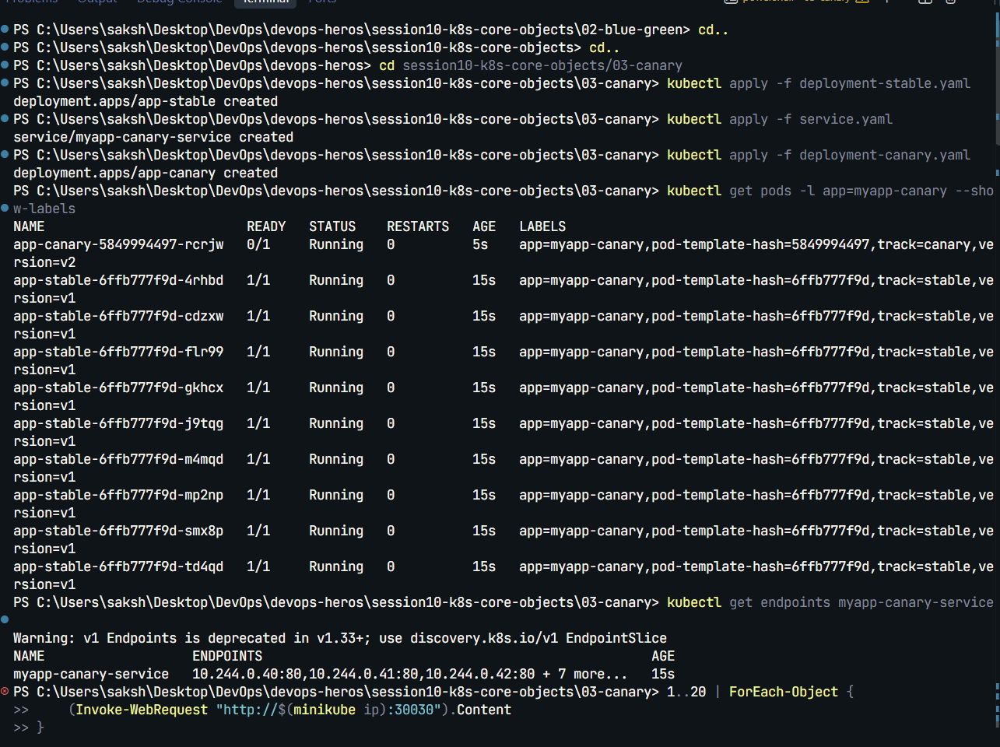

<br><br>

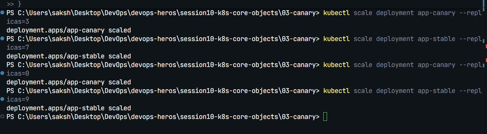

See the [Recreate notes](04-recreate/README.md) for strategy details.

---

## Task 13: Deploying a DaemonSet

- **Description:** Deploy a `node-exporter` DaemonSet and inspect its status and node placement.
- **File Reference:** [`k8s-core-objects/deamonset.yml`](k8s-core-objects/deamonset.yml)
- **Commands Run:**

  ```powershell
  kubectl apply -f k8s-core-objects/deamonset.yml
  kubectl get daemonset
  kubectl get pods -l app=node-exporter -o wide
  ```

### Solution / Observation

The screenshot shows one `node-exporter` Pod on the eligible Minikube node. A DaemonSet manages one Pod per eligible node rather than using a fixed replica count.

### Screenshot

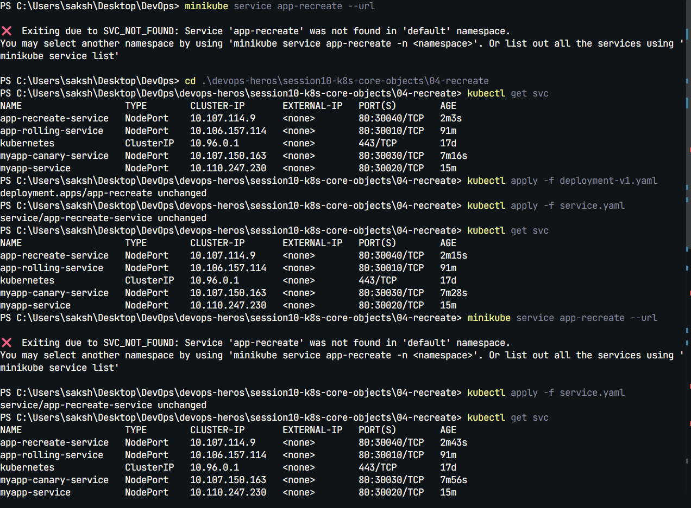

<br><br>

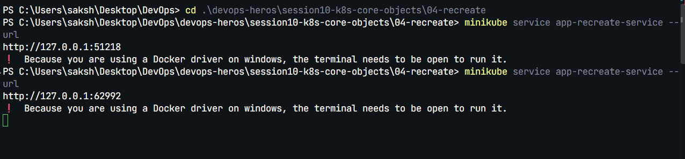

---

## Additional Manifests

- [`deployment.yml`](deployment.yml): NGINX Deployment example.
- [`service.yml`](service.yml): NodePort Service example.
- [`k8s-core-objects/`](k8s-core-objects/): core workload manifests, including a StatefulSet.
- [`pod-lifecycle/README.md`](pod-lifecycle/README.md): commands and examples for Pending, Succeeded, Failed, CrashLoopBackOff, probes, init containers, multi-container Pods, and graceful termination.
