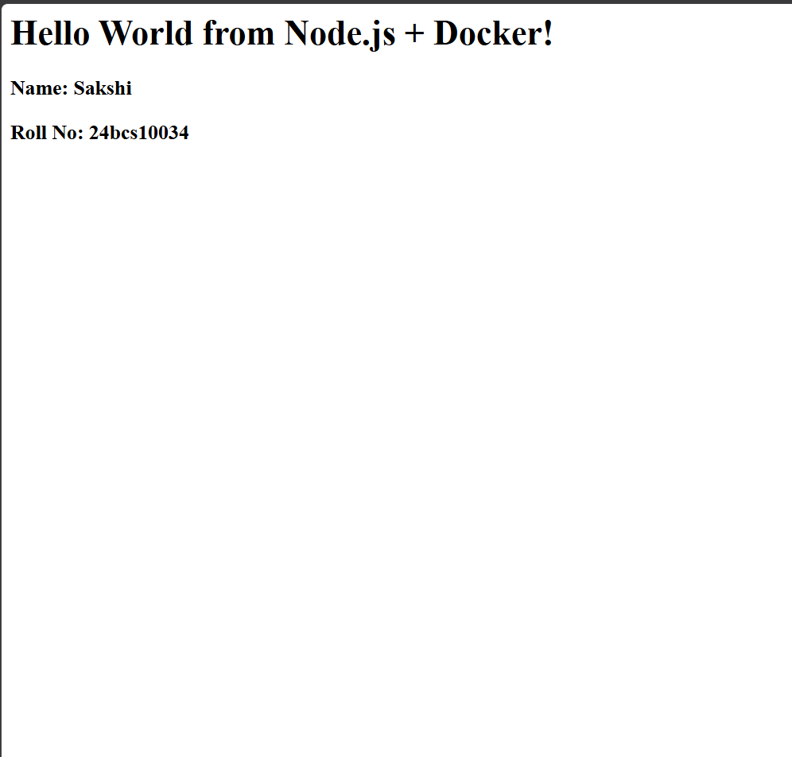
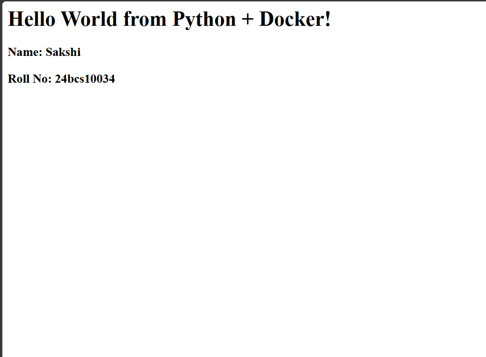
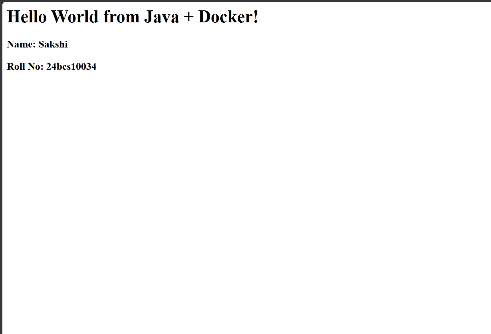
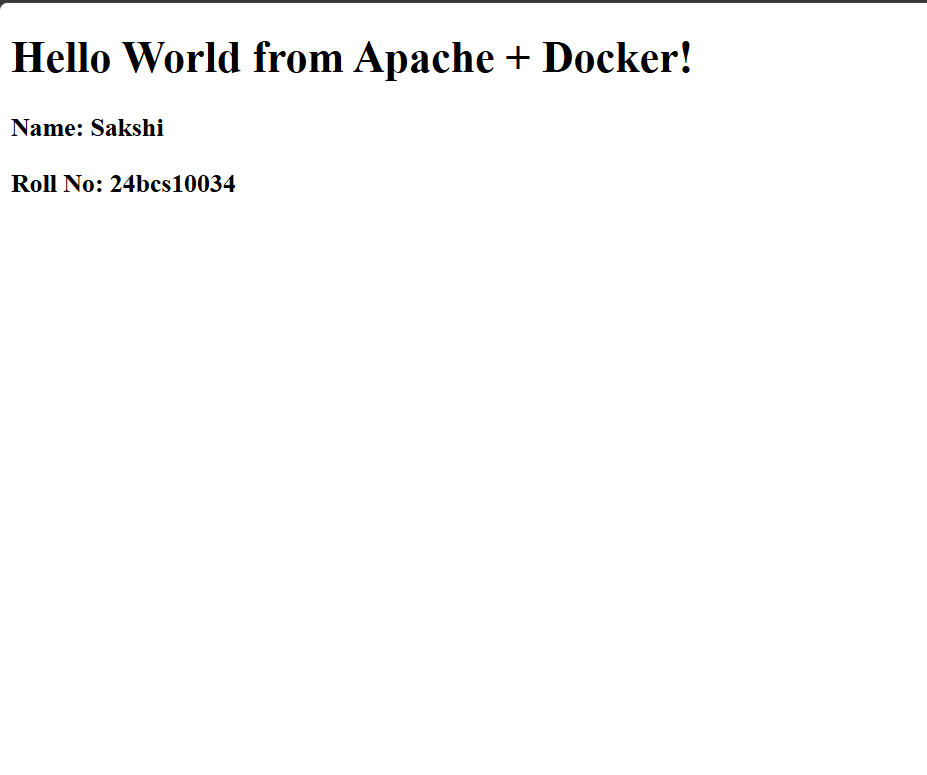
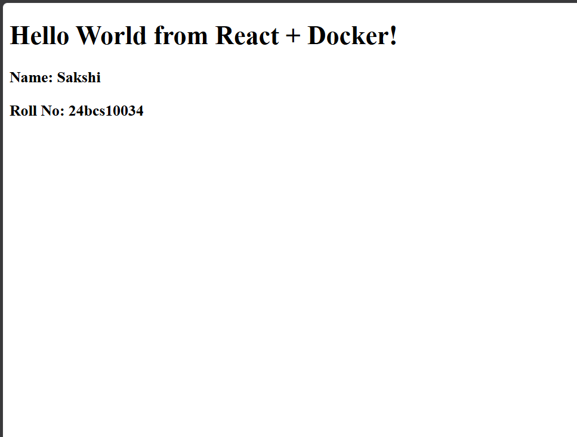
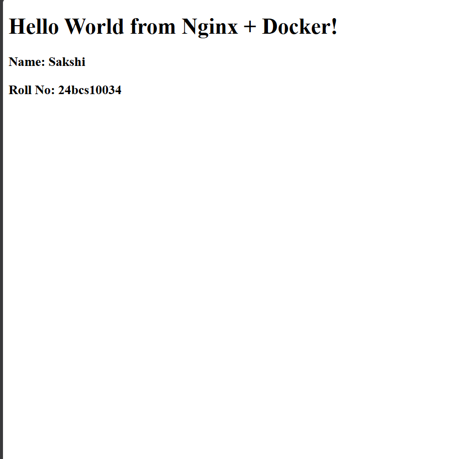

# Docker Images - Hello World Applications

## Overview

This practical focused on creating and running simple web applications using Docker.

Six applications were containerized:

1. Node.js
2. Python Flask
3. Java
4. Apache HTTP Server
5. React
6. Nginx

Each application has its own folder and Dockerfile. The images were built successfully, the containers were started, and the applications were verified in a web browser.

---

## 1. Node.js Application

### Objective

Create a simple Express web application, containerize it with Docker, and access it through a browser.

### Application Code

The Node.js application uses Express and listens on port `3000`.

```javascript
const express = require("express");

const app = express();
const PORT = 3000;

app.get("/", (req, res) => {
  res.send("<h1>Hello World from Docker!</h1>");
});

app.listen(PORT, () => {
  console.log(`Server running on port ${PORT}`);
});
```

### Dockerfile

```dockerfile
FROM node:24-alpine

WORKDIR /app

COPY package*.json ./
RUN npm install

COPY . .

EXPOSE 3000

CMD ["npm", "start"]
```

### Build and Run

```bash
cd node-app
docker build -t hello-node .
docker run -d --name hello-node-container -p 3000:3000 hello-node
```

The application was accessed at `http://localhost:3000`.



---

## 2. Python Flask Application

### Objective

Create a Flask Hello World application, containerize it with Docker, and access it through a browser.

### Application Code

```python
from flask import Flask

app = Flask(__name__)

@app.route("/")
def home():
	return """
	<h1>Hello World from Python + Docker!</h1>
	<h3>Name: Sakshi</h3>
	<h3>Roll No: 24bcs10034</h3>
	"""

app.run(host="0.0.0.0", port=5000)
```

### Dockerfile

```dockerfile
FROM python:3.11

WORKDIR /app

COPY app.py .
RUN pip install flask

EXPOSE 5000

CMD ["python", "app.py"]
```

### Build and Run

```bash
cd python-app
docker build -t hello-python .
docker run -d --name hello-python-container -p 5001:5000 hello-python
```

Host port `5001` maps to container port `5000`. The application was accessed at `http://localhost:5001`.



---

## 3. Java Application

### Objective

Create a lightweight Java web server using Java's built-in `HttpServer`, containerize it, and access it through a browser.

### Application Code

The Java server listens on port `8080` and returns a Hello World HTML response.

```java
HttpServer server = HttpServer.create(
		new InetSocketAddress(8080), 0);

server.createContext("/", exchange -> {
	String response =
			"<h1>Hello World from Java + Docker!</h1>" +
			"<h3>Name: Sakshi</h3>" +
			"<h3>Roll No: 24bcs10034</h3>";

	exchange.getResponseHeaders().set("Content-Type", "text/html");
	exchange.sendResponseHeaders(200, response.getBytes().length);

	OutputStream os = exchange.getResponseBody();
	os.write(response.getBytes());
	os.close();
});
```

### Dockerfile

```dockerfile
FROM eclipse-temurin:17

WORKDIR /app

COPY Main.java .
RUN javac Main.java

EXPOSE 8080

CMD ["java", "Main"]
```

### Build and Run

```bash
cd java-app
docker build -t hello-java .
docker run -d --name hello-java-container -p 8080:8080 hello-java
```

The application was accessed at `http://localhost:8080`.



---

## 4. Apache HTTP Server

### Objective

Create a static HTML Hello World page and serve it using Apache inside a Docker container.

### HTML Application

```html
<!DOCTYPE html>
<html>
<body>
	<h1>Hello World from Apache + Docker!</h1>
	<h3>Name: Sakshi</h3>
	<h3>Roll No: 24bcs10034</h3>
</body>
</html>
```

### Dockerfile

```dockerfile
FROM httpd:2.4

COPY index.html /usr/local/apache2/htdocs/

EXPOSE 80
```

### Build and Run

```bash
cd Apache-app
docker build -t hello-apache .
docker run -d --name hello-apache-container -p 8081:80 hello-apache
```

Host port `8081` maps to container port `80`. The application was accessed at `http://localhost:8081`.



---

## 5. React Application

### Objective

Create a React Hello World application, build it with Vite, and serve the production build from a Docker container.

### Application Code

```jsx
function App() {
	return (
		<div>
			<h1>Hello World from React + Docker!</h1>
			<h3>Name: Sakshi</h3>
			<h3>Roll No: 24bcs10034</h3>
		</div>
	);
}
```

### Dockerfile

```dockerfile
FROM node:20

WORKDIR /app

COPY package.json .
COPY index.html .
COPY src ./src

RUN npm install
RUN npm run build
RUN npm install -g serve

EXPOSE 3000

CMD ["serve", "-s", "dist", "-l", "3000"]
```

### Build and Run

```bash
cd React-app
docker build -t hello-react .
docker run -d --name hello-react-container -p 3001:3000 hello-react
```

Host port `3001` maps to container port `3000`. The application was accessed at `http://localhost:3001`.



---

## 6. Nginx Web Server

### Objective

Create a static HTML Hello World page and serve it using Nginx inside a Docker container.

### HTML Application

```html
<!DOCTYPE html>
<html>
<body>
	<h1>Hello World from Nginx + Docker!</h1>
	<h3>Name: Sakshi</h3>
	<h3>Roll No: 24bcs10034</h3>
</body>
</html>
```

### Dockerfile

```dockerfile
FROM nginx:latest

COPY index.html /usr/share/nginx/html/index.html

EXPOSE 80
```

### Build and Run

```bash
cd nginx-app
docker build -t hello-nginx .
docker run -d --name hello-nginx-container -p 8082:80 hello-nginx
```

Host port `8082` maps to container port `80`. The application was accessed at `http://localhost:8082`.



---

## Docker Concepts Practiced

| Instruction | Purpose |
| --- | --- |
| `FROM` | Specifies the base image. |
| `WORKDIR` | Sets the working directory inside the container. |
| `COPY` | Copies application files into the image. |
| `RUN` | Executes commands while building the image. |
| `EXPOSE` | Documents the port used by the application. |
| `CMD` | Specifies the default command when the container starts. |

### Docker Build

The `docker build` command creates an image from a Dockerfile:

```bash
docker build -t <image-name> .
```

### Docker Run

The `docker run` command creates and starts a container:

```bash
docker run -d --name <container-name> -p <host-port>:<container-port> <image-name>
```

### Port Mapping

Port mapping connects a host port to a port inside the container. For example:

```text
Host port 5001 -> Container port 5000
```

This allows the Python application running on port `5000` inside the container to be accessed through port `5001` on the host.

## Verification

```bash
docker images
docker ps
```

The images and running containers can be viewed with these commands.

## Directory Structure

```text
session6-7-docker/
├── Apache-app/
│   ├── Dockerfile
│   └── index.html
├── java-app/
│   ├── Dockerfile
│   └── Main.java
├── node-app/
│   ├── Dockerfile
│   ├── package.json
│   └── server.js
├── python-app/
│   ├── Dockerfile
│   └── app.py
├── React-app/
│   ├── Dockerfile
│   ├── index.html
│   ├── package.json
│   └── src/main.jsx
├── nginx-app/
│   ├── Dockerfile
│   └── index.html
├── screenshots/
└── README.md
```

## Result

Six different applications were successfully containerized using Docker. Each application was built into a Docker image, run as a container, and verified through a web browser.

This practical provided hands-on experience with Dockerfiles, Docker images, containers, port mapping, static web servers, backend services, and frontend builds.

## Author

**Sakshi**  
**Roll No: 24BCS10034**