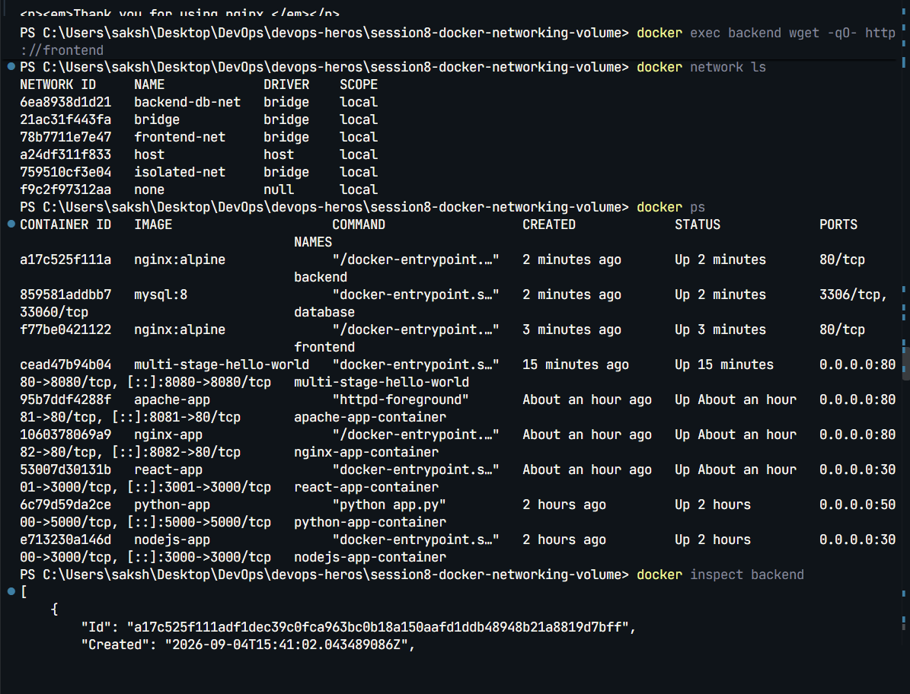
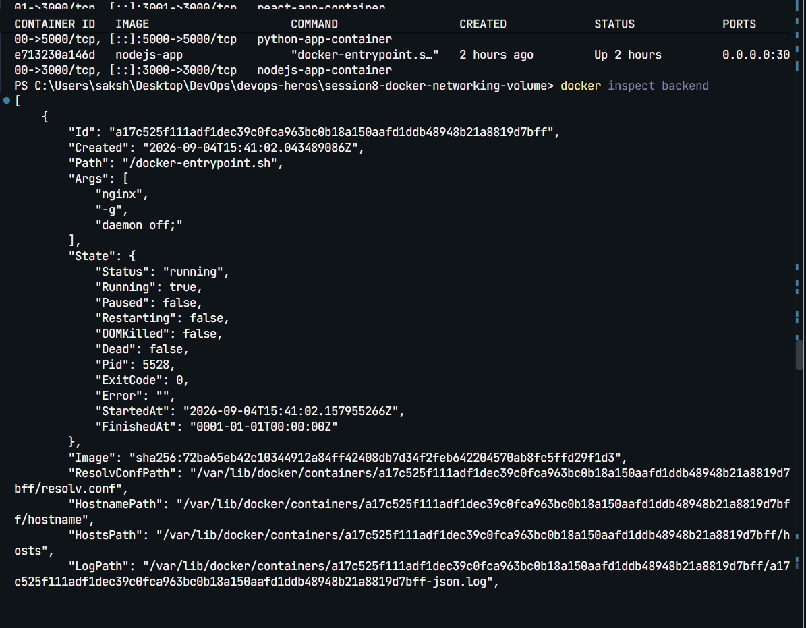
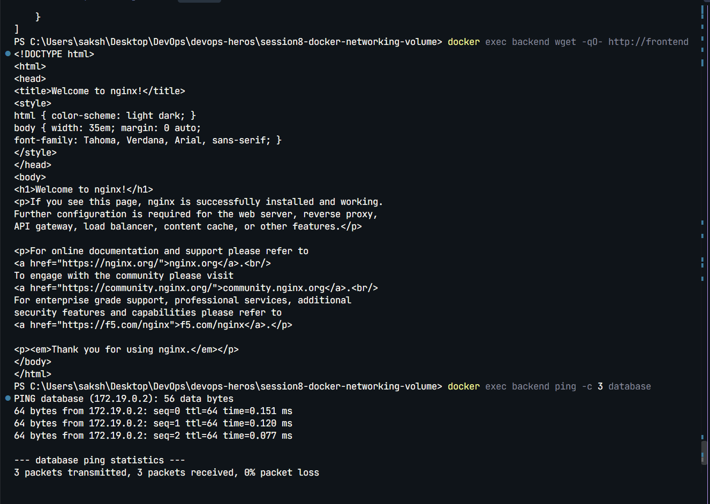
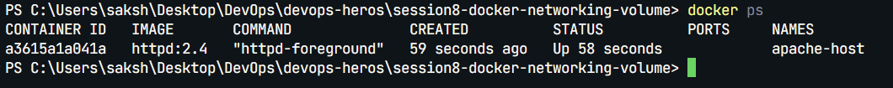
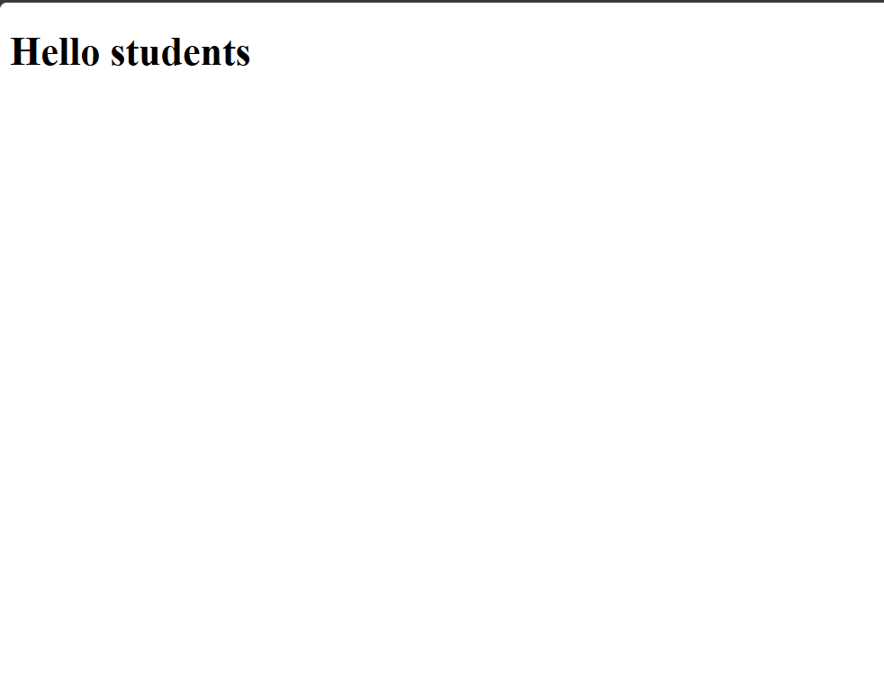
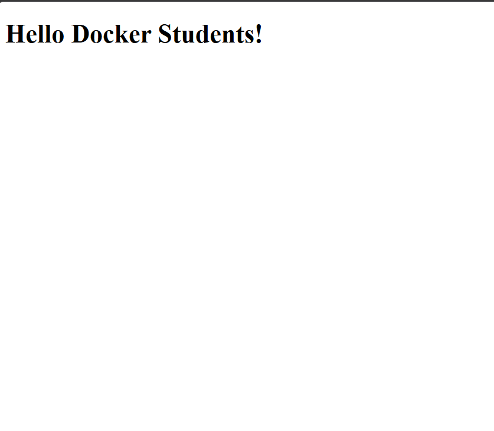
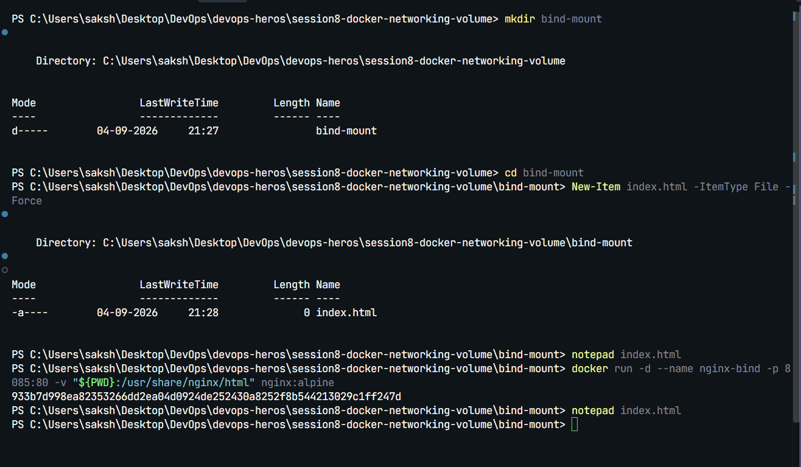
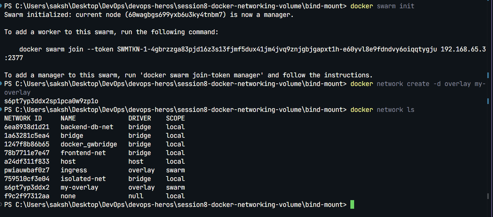

# Docker Networking and Volumes

## Overview

This practical demonstrated Docker Compose, container networking, named volumes, and bind mounts using Nginx, Flask, and MySQL.

## Docker Compose

The root Compose file creates an Nginx frontend, an Nginx backend, and a MySQL database:

```yaml
services:
  frontend:
    image: nginx
    ports:
      - "8080:80"

  backend:
    image: nginx

  database:
    image: mysql:8.0
    environment:
      MYSQL_ROOT_PASSWORD: root
    volumes:
      - db_data:/var/lib/mysql

volumes:
  db_data:
```

Run it with:

```bash
docker compose up -d
docker compose ps
docker compose down
```

The frontend is available at `http://localhost:8080`.

## Named Volume

The `db_data` volume stores MySQL data outside the container, allowing it to persist after the container is recreated.

```bash
docker volume ls
docker volume inspect db_data
```

## Bind Mount

The `bind-mount` folder contains an HTML file that can be mounted into Nginx:

```bash
docker run -d --name nginx-bind-mount -p 8081:80 `
  -v "${PWD}/bind-mount/index.html:/usr/share/nginx/html/index.html" `
  nginx:latest
```

Open `http://localhost:8081` to view the mounted page.

## Three-Tier Demo

The `demo` folder contains:

```text
Browser -> Nginx frontend -> Flask backend -> MySQL database
```

The frontend proxies `/api` requests to `backend:5000`. The backend connects to MySQL using the service name `database`.

| Network | Services |
| --- | --- |
| `frontend_net` | frontend, backend |
| `backend_net` | backend, database |

Run the demo from the `demo` directory:

```bash
docker compose up -d --build
docker compose ps
docker compose logs -f
docker compose down
```

Open `http://localhost:8080` and click **Get Data From Backend**.

## Verification

```bash
docker ps
docker network ls
docker volume ls
```

### Task 1: Docker Container Networking







### Task 2: Host Network




### Task 3: Bind Mount







### Task 4: Overlay Network



## Directory Structure

```text
session8-docker-networking-volume/
├── bind-mount/index.html
├── demo/
│   ├── backend/
│   ├── frontend/
│   └── docker-compose.yml
├── docker-compose-app/docker-compose.yml
├── docker-compose.yml
├── screenshots/
└── README.md
```

## Result

Docker networking, Compose services, named volumes, and bind mounts were successfully configured and tested.

## Author

**Sakshi**  
**Roll No: 24BCS10034**

## Resource

- [Docker network drivers](https://docs.docker.com/engine/network/drivers/)
