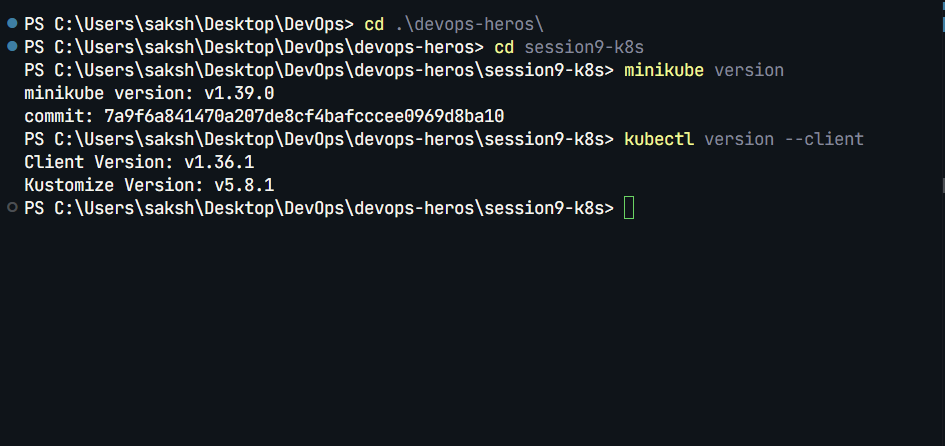
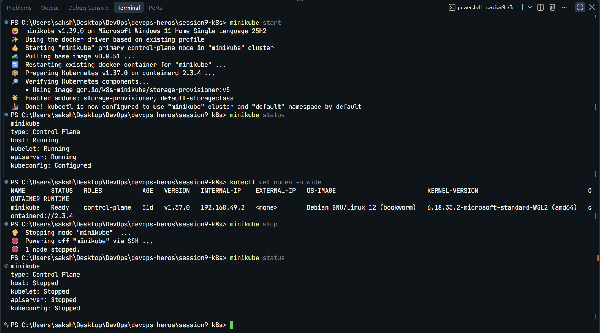

# Session 9: Kubernetes Fundamentals & Cluster Architecture

In this session, I verified my local Kubernetes command-line tools, started and stopped a Minikube cluster, and reviewed the core Kubernetes control-plane and worker-node components.

## Task 1: Minikube and kubectl Setup

Verified that both CLIs are installed and available in PowerShell:

```powershell
minikube version
kubectl version --client
```

My environment reported Minikube `v1.39.0` and kubectl client `v1.36.1`.



## Task 2: Minikube Cluster Lifecycle

Started Minikube with the Docker driver, checked the cluster status and node readiness, then stopped the cluster cleanly:

```powershell
minikube start
minikube status
kubectl get nodes -o wide
minikube stop
minikube status
```

The cluster ran Kubernetes `v1.37.0`. The `minikube` node reported `Ready` with the `control-plane` role. After stopping the cluster, the host, kubelet, API server, and kubeconfig status were shown as stopped.



## Task 3: Kubernetes Architecture and Core Components

### Architecture Overview

```text
+-----------------------------------------------------------------------+
|                         CONTROL PLANE                                 |
|                                                                       |
|  +-------------+      +------------------+      +-----------------+   |
|  |    etcd     |<---->|  kube-apiserver  |<---->| kube-scheduler  |   |
|  +-------------+      +--------+---------+      +-----------------+   |
|                               |                                       |
|                               v                                       |
|                    +-------------------------+                        |
|                    | kube-controller-manager |                        |
|                    +-------------------------+                        |
+-------------------------------+---------------------------------------+
                                |
                                v
+-----------------------------------------------------------------------+
|                           WORKER NODE                                 |
|                                                                       |
|   +-----------+     +------------+     +--------------------------+   |
|   |  kubelet  |     | kube-proxy |     | Container Runtime (CRI)  |   |
|   +-----+-----+     +------------+     +------------+-------------+   |
|         |                                         |                   |
|         +-----------------------------------------+                   |
|                                                   v                   |
|                                              +---------+              |
|                                              |  Pods   |              |
|                                              +---------+              |
+-----------------------------------------------------------------------+
```

### Control Plane Components

- **`kube-apiserver`**: The cluster's API entry point. `kubectl` and Kubernetes components communicate with the cluster through the API server.
- **`etcd`**: A distributed key-value store that holds Kubernetes cluster state, object specifications, and metadata.
- **`kube-scheduler`**: Watches for Pods that have not been assigned to a node and selects a suitable node based on resource requirements and scheduling constraints.
- **`kube-controller-manager`**: Runs controllers that reconcile actual cluster state with the desired state.

### Worker Node Components

- **`kubelet`**: The node agent that receives Pod specifications and ensures the required containers are running.
- **`kube-proxy`**: Maintains networking rules that allow Kubernetes Services to route traffic to Pods.
- **Container runtime / CRI**: Runs the containers. Common examples include `containerd` and `CRI-O`.
- **Pod**: The smallest deployable Kubernetes unit. A Pod can contain one or more tightly coupled containers that share networking and storage resources.

### How the Components Interact

1. A user submits the desired state with `kubectl` to the API server.
2. The API server validates the request and stores the cluster state in `etcd`.
3. The scheduler selects a suitable node for each unscheduled Pod.
4. Controllers continuously compare actual state with desired state and request corrective changes when needed.
5. The node's kubelet observes its assigned Pod specifications and asks the container runtime to run the containers.
6. `kube-proxy` maintains Service networking rules so traffic can reach the appropriate Pods.

## Key Takeaways

- The control plane manages and reconciles the cluster's desired state.
- Worker nodes run workloads and provide the networking and runtime support they need.
- Minikube provides a local Kubernetes cluster for development and practice.